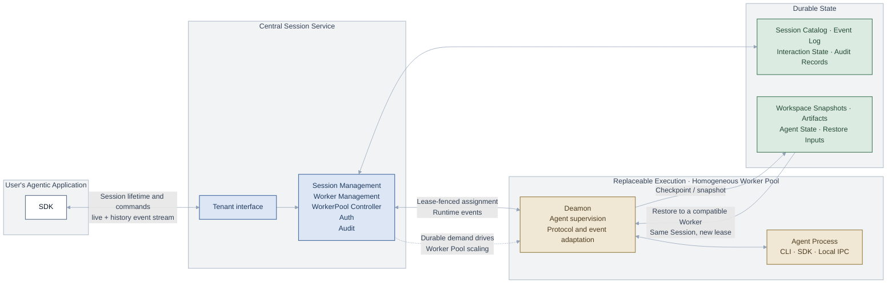

# Architecture & Design

## Architecture overview

Agent Runtime Sidecar turns existing agents into durable online services. Applications interact with stable Session identities through the Central Session Service, while replaceable Workers execute sessions through a nearby Sidecar. Tenant Runtime owns routing, lifecycle, authorization, audit, and lease fencing. Durable event history and workspace snapshots allow the same Session to reconnect, pause, resume, or recover on a compatible Worker.

## Key architectural decisions

- **Session is a first-class durable object.** It preserves identity, state, workspace, and recovery while interchangeable Workers provide compute.
- **Central separates durable work from elastic compute.** It manages Session lifecycles, Worker scheduling and capacity, and lease fencing so compute can be released independently.
- **Agent-to-Worker compatibility is declarative.** AgentSpec and WorkerPool define requirements and capabilities; labels and selectors define their scheduling relationship.
- **Agent-to-Agent communication is Spec-defined and location-independent.** Delegate and AgentSpec references let Central route work through durable Child Sessions regardless of where Agents run.
- **The framework is extensible by design.** Custom Agent and host-pool adapters connect different runtimes and hosting backends without changing core contracts.

## Known limitations / future work

Session recovery currently depends on graceful, runtime-controlled lifecycle transitions that persist recovery state before compute is released. Recovery from non-graceful failures, such as Agent process or Worker crashes, is not yet supported and remains future work.