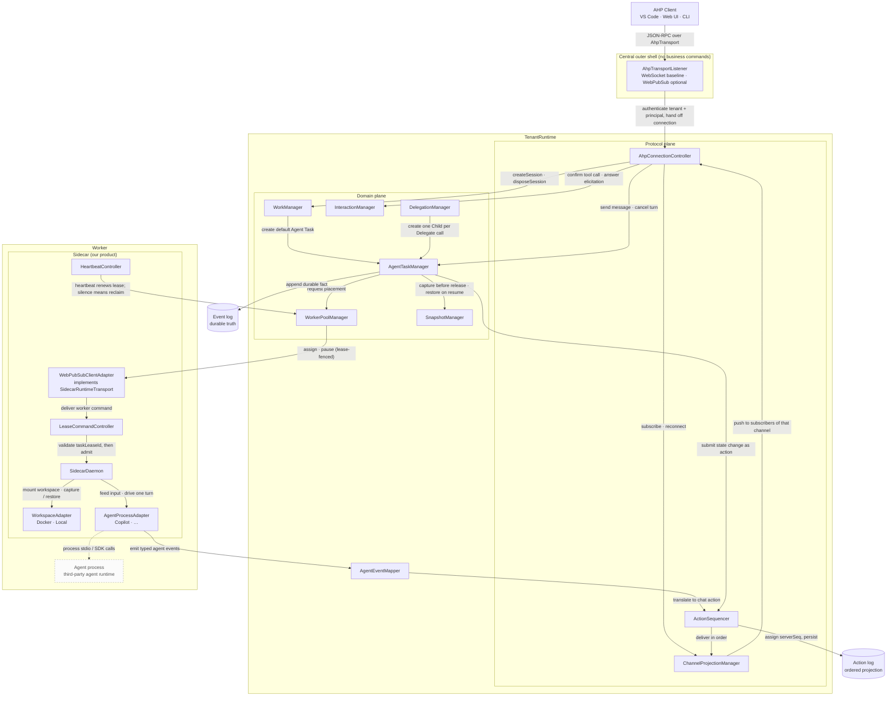

# 成为 AHP Host：架构对齐报告

状态：架构研究与目标态提案
读者：架构师、runtime owner、central/sidecar owner、SDK owner

参考基线：
- 协议侧：`C:\Users\chenyl\agent-host-protocol`，`PROTOCOL_VERSION = 0.7.0`（DRAFT，明确预期 breaking change）。
- 运行时侧：本仓库 [runtime-resource-model-ch.md](runtime-resource-model-ch.md)、[durable-interaction-broker-ch.md](durable-interaction-broker-ch.md)、[durable-agent-delegation-ch.md](durable-agent-delegation-ch.md)、[../sdk/client/public-protocol-spec-ch.md](../sdk/client/public-protocol-spec-ch.md) 与 `src/`。

---

## 1. 结论

**可以做，而且做完之后架构会比现在更干净。** AHP 要解决的问题（N 个 client 共享同一批 agent 工作的状态同步）与我们要解决的问题（Work 是 durable identity、Worker 是可替换算力）是正交的，且 AHP 官方 doctrine 明确把 agent loop、model provider、tool registry、hosting、恢复语义都排除在协议之外——这些恰好全部是我们的地盘。AHP 不会要求我们放弃 Worker/WorkerPool/lease/snapshot/pause/Delegation 中的任何一个。

### 术语

三个词必须分清，spec 全文按此使用：

| 词 | 指什么 | 拥有者 | AHP 侧对应 |
| --- | --- | --- | --- |
| **Work** | 一件持久的业务工作。归属、Agent Task 清单、事件日志、审计都挂在它上，状态与待审批由它聚合 | 我们（控制面） | `ahp-session:/<uuid>` |
| **Agent Task** | Work 里的一段工作：一个已解析 AgentSpec + 一份 workspace + 一条 turn 序列绁定在一起，可单独放置到某个 Worker 上 | 我们（控制面） | `ahp-chat:/<cid>` |
| **Runtime Session** | 一次具体执行的运行环境实例 | 运行时（Foundry Hosted agent / Docker / 自有集群） | 不出现在 AHP wire 上 |

代码侧的重命名：`SessionRecord` → `WorkRecord`（`sessionId` → `workId`）；新增 `AgentTaskRecord`；`sessionLeaseId` → `taskLeaseId`（租约占的是一段 Agent Task，不是一个 session）；`Worker` / `HostPoolInstance` 不改。

本文出现 `ahp-session`、`SessionState`、`createSession`、`listSessions` 时，都是 **AHP 协议词**，保持原样。我们不争「session」这个词：它对外归运行时，对内只作为 AHP 的协议字段名出现。

### 指导原则

**一、资源模型必须完整符合 AHP，运行时行为用 capability 收窄。** 凡是 AHP 用 capability 表达的可选能力（多 chat、fork/sideChat、多工作目录），我们的模型都必须无条件支持，由 adapter 的能力声明和 controller 的准入策略决定实际开放到什么程度。任何把"当前只需要这么多"硬编码进资源身份、存储布局或事件信封的做法都是把净效果当成了原语，将来放开时会变成模型改动而不是配置改动。

**二、不迁就现状。** 现有实现里建错的部分一并改掉，不为了减少 diff 而保留。判断标准只有一个：**改完之后的模型是不是干净的**。本仓处于预发布阶段，没有外部用户数据需要兼容，因此不写 fallback、不写兼容 shim、不保留双行为路径；一次性 dev 数据直接删。如果某个决定写出来丑，先回头问“是不是在迁就一个本身就建错的模型”，而不是把丑写进映射层。需要一并修掉的现有缺陷见第 7 节。

### 必须改的内部设计

这**不是加一层适配器就能自然实现**的事情。有四处：

1. **Work / Agent Task 职责切分**：`AgentTaskRecord` 成为一等 durable 资源，拥有独立 `agentTaskId`、自己的 turn 序列，以及 **Worker 绑定、lease、workspace、snapshot**；Work 拥有归属、Agent Task 清单、project、事件日志与审计，并派生出状态聚合。事件信封新增 `agentTaskId`。
2. **客户端协议形态**：从"Web PubSub group 广播 + 自造 `ackId` 关联 + 扁平事件流"换成"单条双向 JSON-RPC 流 + channel 订阅 + 有序 action + snapshot/replay"。`ackId`、`client-private-inbox`、`SdkRuntimeEvent` 这套关联机制会被 JSON-RPC request id 与 `serverSeq` 完整取代。
3. **Turn 内容模型**：`agent.output` 这个大杂烩 payload 无法被 reduce，必须拆成 typed response part（create-then-append，带 `partId`）与 tool call 状态机（七态，带 `toolCallId`）。
4. **Interaction 的对外表达**：durable Interaction broker 的内部机制（CAS、first-response-wins、lease fencing）全部保留，但对外不再是独立的 `interaction.*` 事件族，而是收编进 AHP 的 tool call confirmation / client tool execution / elicitation 三条既有通道，并由 `session/inputNeeded` 做 Work 级聚合。

不需要改：event log 作为 durable truth 的地位、Worker/WorkerPool/HostPoolInstance/lease/snapshot 全套调度与恢复、tenant/authorization/audit 边界。

有一处 AHP 目前没有表达能力：**pause/resume**。这是我们的核心差异化能力，AHP 词汇表里没有对应命令。结论是把它保留为 host 内部生命周期，在 AHP 视图里只体现为 `status`/`activity` 变化，并向上游提 proposal。

---

## 2. AHP 事实基线

### 2.1 协议骨架

| 维度 | 事实 |
| --- | --- |
| 消息框架 | JSON-RPC 2.0 |
| 传输 | 不规定，要求可靠、有序、双向、完整消息边界；WebSocket 是事实标准（VS Code 参考实现用它） |
| 路由键 | 每一条 command params 和每一条 notification params 都带顶层 `channel: URI`；连接级命令固定为字面量 `'ahp-root://'` |
| 状态模型 | 每个 state channel 持有一棵不可变状态树，只能由 action 经 pure reducer 变更 |
| 排序 | server 为每个 action 分配全局单调 `serverSeq`，装进 `ActionEnvelope` |
| 一致性 | write-ahead reconciliation：client 乐观应用自己的 action，server 回声后对账；server-wins |
| 断线恢复 | `reconnect(clientId, lastSeenServerSeq, subscriptions[])` → replay 缺失的 action envelope，或超出 buffer 时下发全新 snapshot；protocol notification 不重放 |
| 版本 | SemVer，`initialize` 一次性协商；capability-first，然后才 promote 成 baseline |

### 2.2 Channel 层级

```text
ahp-root://                 RootState { agents, activeSessions, terminals, config }
  └─ session catalog        不在 state 里：listSessions() + root/sessionAdded|Removed|SummaryChanged
ahp-session:/<uuid>         SessionState { provider, title, status, activity, lifecycle,
                                           chats[], defaultChat, activeClients[], serverTools[],
                                           customizations[], changesets[], inputNeeded[], config }
  └─ ahp-chat:/<cid>        ChatState { turns[], activeTurn, responseParts, steering/queued,
                                        draft, status, activity, origin, workingDirectories }
ahp-terminal:/<id>          ahp-changeset:/<id>   ahp-otlp:   ahp-resource-watch:/<id>
```

关键点：**session 是协调作用域，chat 才是对话内容的载体**。一个 session 默认带一个 chat；多 chat 由 `AgentCapabilities.multipleChats` 门控，支持 `fork` 与 `sideChat`。chat 之间是平等 peer，`ChatOrigin` 只是渲染提示，不是层级结构。

### 2.3 Turn 与 tool call

- `Turn { id, message, responseParts[], usage, state: complete|cancelled|error }`，`ActiveTurn` 是进行中的同构对象。
- `responseParts` 是**单一有序数组**，混合 `markdown` / `reasoning` / `toolCall` / `contentRef` / `inputRequest` / `systemNotification`。
- 文本用 create-then-append：先 `chat/responsePart` 建一个带 `id` 的 part，再用 `chat/delta`（或 `chat/reasoning`）按 `partId` 追加。
- Tool call 是 `status` 上的判别联合，七个状态：`streaming` → `pending-confirmation` → `running` → (`auth-required`) → `pending-result-confirmation` → `completed` / `cancelled`。
- `ToolCallContributor` 区分 `client` 贡献（由某个 active client 执行并回填结果）与 `mcp` 贡献。
- Elicitation 是 `InputRequestResponsePart`：live 交互与 durable 记录是同一个对象，多 client 共享 answer draft。
- `SessionState.inputNeeded` 是 session 级聚合，四种 kind：`chatInput`、`toolConfirmation`、`toolClientExecution`、`toolAuthentication`；每条自带 `chat` URI 与全部回答所需标识，client **无需订阅该 chat** 即可作答。

### 2.4 命令面

- 连接级：`initialize`、`ping`、`reconnect`、`subscribe`、`unsubscribe`、`dispatchAction`、`listSessions`、`authenticate`、`resolveSessionConfig`、`sessionConfigCompletions`。
- session/chat 级：`createSession`、`disposeSession`、`createChat`、`disposeChat`、`fetchTurns`、`completions`。
- 文件系统族（9 个 `resource*` + `createResourceWatch`）：**双向对称**，server 也能向 client 发起。
- terminal / changeset：`createTerminal`、`disposeTerminal`、`invokeChangesetOperation`。
- 错误码：`SessionNotFound -32001`、`ProviderNotFound -32002`、`SessionAlreadyExists -32003`、`TurnInProgress -32004`、`UnsupportedProtocolVersion -32005`、`AuthRequired -32007`、`PermissionDenied -32009`、`Conflict -32011`。

### 2.5 AHP 明确不做的事

agent loop、model provider/路由、tool registry 与 tool schema、agent 之间的协调语义、UI 框架、"每个 workspace 都有本地文件系统或 git"的假设、以及 ACP 的替代品。

**这一段是整份报告最重要的依据**：AHP 是 client-facing presentation & synchronization layer。**我们就是 AHP 定义的 host**，AHP 是我们这个控制面的客户端协议；而 agent 运行时（Foundry Hosted agent、容器、自有集群）在我们之下，不出现在 AHP wire 上。

---

## 3. 我们的事实基线

| 维度 | 现状 |
| --- | --- |
| client 传输 | `POST /client/negotiate` 拿 Web PubSub access URL；client join 四类 group：`tenant-inbox`（发命令）、`client-inbox`（tenant 投影）、`client-private-inbox`（ack/查询响应）、`session-events`（会话内容） |
| 请求关联 | SDK 生成 `ackId`，central 把 ack 事件投到 `client-private-inbox` |
| 事件模型 | 单一扁平 `RuntimeEvent` union（约 50 个 type），`sequence` 是 **per-session** 的 |
| 会话模型 | `SessionRecord`：10 态 `SessionStatus`（created/queued/starting/running/pausing/paused/resuming/completed/cancelled/failed）+ `currentWorkerId` + `sessionLeaseId` + `eventCursor` + `nextTurnSeq` + `workspaceRef` + `latestSnapshotRef` |
| 会话内容 | 没有 chat 概念；`turnSeq` 单调递增；agent 输出全部塞进 `agent.output` 的 `AgentOutputPayload` |
| 交互 | `InteractionRecord`：public `interactionId` / 内部 `adapterRequestId` / `views[]` / revision CAS / owner lease fencing / delivery checkpoint；kind 为 `approval` 或 `tool_call` |
| 委派 | `Delegate`（注册的 subagent tool）→ `Delegation`（per Parent+Delegate 唯一，持有一个可复用 Child Session）→ FIFO `DelegationCall` |
| 算力 | `WorkerPool` / `HostPoolController` / `HostPoolInstance` / `Worker`（心跳租约）+ label selector 匹配 + Docker/Foundry host-pool adapter |
| 恢复 | workspace snapshot + agent state + event log；`reuse:false` 池支持 session-pinned host |
| 治理 | tenant 是一等边界，`TenantRuntime` 是 composition root；`RequestContext.principal` 贯穿 ingress |

---

## 4. 结构性判断

三句话：

1. **我们的 central session service 就是 AHP 意义上的 host。** 它已经具备 AHP 假设的一切前提：host 权威状态、多 client、断线重连、有序事实、session 清单。
2. **我们缺的不是能力，是表达形态。** durable event log 已经是"有序、可 replay、host 权威"的事实流，只是它的形状是"运维事件"而不是"可 reduce 的 UI 状态变更"。
3. **AHP 的 session/chat 二层结构对我们不是负担，它就是 Work / Agent Task。** 我们现在把"协调作用域"和"对话内容"压在同一个 `SessionRecord` 上，这也是为什么 Delegation 的 Parent/Child 关系在 SDK 里只能靠 `parentSessionId` 这样一个扁平字段表达。

---

## 5. 概念映射表

| AHP 概念 | 我们的对应物 | 契合度 | 说明 |
| --- | --- | --- | --- |
| host（一个 AHP endpoint） | 一个 `TenantRuntime` | 天然 | 一个 AHP 连接 = 一个 tenant 视图；tenant 在 transport 握手确定，不进 AHP wire |
| `ahp-root://` / `RootState` | tenant 级 registry 投影 | 天然 | `agents[]` 来自 `AgentSpecRegistry`，`activeSessions` 来自 session catalog |
| `AgentInfo.provider` | `AgentSpec.agentSpecId` | 天然 | AgentSpec 的 launch/selector/pausePolicy 等调度字段不上 wire |
| `AgentInfo.models[]` | 尚未建模 | 缺口 | 先返回空数组；模型选择进入产品范围后从 AgentSpec 的 provider config 派生 |
| `listSessions` + `root/session*` | `session.list.requested` + `client-inbox` 的 `session.catalog.updated` / `session.status.updated` | 天然 | 语义几乎一一对应，我们已经有 tenant 投影通道这个概念 |
| `ahp-session:/<uuid>` | `WorkRecord`（现 `SessionRecord`） | 需改 id 来源 | 见决定 A |
| `SessionState.lifecycle` | 无直接对应 | 映射 | `creating` → 首次进入 running 之前；之后恒为 `ready` |
| `SessionState.status`（位集） | `SessionStatus`（10 态） | 映射 | 见决定 D |
| `SessionState.activity` | `lifecycleReason` + 状态名 | 天然 | AHP 明确把它定义为人类可读描述，正好装我们的 `queued`/`paused`/`resuming` |
| `SessionState.serverTools` | `ResolvedAgentSpec.runtimeTools` | 天然 | Delegate 派生的 subagent tool 就是 server tool |
| `SessionState.activeClients[].tools` | 无 | 新增 | 我们的 `interaction kind='tool_call'` 隐含了"client 提供工具"，AHP 让它显式化 |
| `ahp-chat:/<cid>` / `ChatState` | 无 | 新增一等资源 | `AgentTaskRecord` 独立 `agentTaskId`；见决定 B |
| `SessionState.chats[]` / `defaultChat` | 无 | 新增 | Work 拥有 Agent Task 清单；见决定 B |
| `SessionMetadata.project` | 无 | 新增 | Work 层的「在做什么」（仓库/工单/数据集）；与物理 workspace 无关，见决定 B |
| `Turn` / `ActiveTurn` | `turnSeq` + event 序列 | 需改内容模型 + 改作用域 | 序列从 Work 迁到 Agent Task（决定 B），内容 typed 化（决定 C） |
| `chat/turnStarted` | `input.accepted` | 天然 | |
| `chat/delta` + `chat/responsePart` | `agent.output.delta` / `.message` | 需改 | 缺 `partId`，无法可靠 reduce |
| `ToolCallState` 七态 | `agent.output.toolStarted/.toolCompleted` + 独立的 `interaction` | 需合并 | 见决定 C |
| `chat/turnComplete` / `chat/error` | `turn.completed` / `turn.failed` | 天然 | |
| `chat/usage` / `UsageInfo` | 无 | 新增 | 低成本 |
| `InputRequestResponsePart`（elicitation） | 无独立表达 | 新增 | |
| `SessionInputRequest.toolConfirmation` | `Interaction kind='approval'` | 需绑定 toolCallId | 见决定 C |
| `SessionInputRequest.toolClientExecution` | `Interaction kind='tool_call'` | 天然 | |
| `ChatOrigin.kind='tool'` + `ToolResultSubagentContent` | `Delegation` / Child | 高度契合 | Child 是同一 Work 下的另一个 Agent Task；见决定 E |
| `ChatInteractivity.ReadOnly` | 无 | 新增 | 正是为 agent-team / worker chat 设计 |
| `disposeSession` | 无（只有 cancel） | 新增 | |
| pause / resume | `session.pause.requested` / `session.resume.requested` | **AHP 无对应** | 见决定 F |
| Worker / WorkerPool / HostPoolInstance / lease | — | AHP 不涉及 | 完全留在 host 内部 |
| WorkspaceSnapshot / restore / recovery mode | — | AHP 不涉及 | 完全留在 host 内部 |
| tenant / audit | — | AHP 不涉及 | 完全留在 host 内部 |
| `authenticate` + `protectedResources` | 无 | 新增 | RFC 9728/6750 语义 |
| `resource*` 文件系统族 | 无 | 可后置 | 我们的 workspace 在 Worker 里，可作为差异化能力 |
| terminal / changeset / annotations / otlp / MCP customizations | 无 | 不实现 | AHP 增量可采纳，不声明 capability 即可 |

---

## 6. 六个必须做出的结构性决定

每条给出唯一结论，不留实现分支。

### 决定 A：Work identity 改为 client 生成

**现状**：`sessionId` 由 central 生成，client 靠 `ackId` 把创建请求和结果关联起来。
**AHP 要求**：client 挑 URI（`ahp-session:/<uuid>`），`createSession` 以 URI 为幂等键，重复则返回 `SessionAlreadyExists -32003`。

**决定**：`WorkRecord.workId` 改为 client 提供的 UUID，central 只负责 admission 与唯一性校验。

**理由**：这不是让步，是净简化。它让 create 天然幂等（重试不会造出第二个 Work），让 client 在 RPC 返回前就能 `subscribe`，并且直接消灭 `ackId` + `client-private-inbox` 这一整套自造关联机制——JSON-RPC 的 request id 已经覆盖它。

**影响面**：`SessionManager.startSession`、`SessionStartManager`、SDK、`session.create.requested` payload。改动小，风险低。

### 决定 B：Agent Task 是一等 durable 资源，Work 不拥有算力

AHP 的 session/chat 二层结构就是 Work / Agent Task。AHP 的多 chat 提案把 session 定义为「协调作用域，拥有共享的 workspace、project、**默认**模型和 agent、配置」，chat 定义为「这个作用域上的一条对话流」；动机场景第一条就是「一队专门化的 agent（reviewer、test-writer、implementer）并行工作」，并且明确写着 agent 在哪跑、worker 怎么起属于 harness 层，AHP 不管。

所以：**一个 Work 下的多个 Agent Task 可以是不同 agent，可以跑在不同 Worker 上，AHP 对此没有任何限制。**

#### B.0 Agent Task 的定义

**一个 Agent Task = 一个已解析的 AgentSpec + 一份 workspace + 一条 turn 序列，三者绑定在一起，共同组成一段可暂停、可恢复、可单独放置到某个 Worker 上的工作。**

三者必须同生同死：换一个 AgentSpec 就是换一个 agent，它看不懂前一个 agent 的 turn 历史；换一份 workspace 就是换一个工作现场，旧 turn 里的文件引用全部失效。因此它们不能分属不同资源。

**什么时候产生一个新 Agent Task**，完整列举（没有第四种）：

| 触发 | 产生者 | `origin` |
| --- | --- | --- |
| Work 创建 | central 自动建默认 Agent Task | 无 |
| Parent 调用一个 Delegate tool | `DelegationManager` | `{ kind: 'tool', chat, toolCallId }` |
| client 显式 `createChat` | client（需声明 `fork` / `sideChat`，见 B.4；当前不声明） | `{ kind: 'fork' \| 'sideChat', chat }` |

**什么不会产生新 Agent Task**：pause / resume / 换 Worker / 恢复 snapshot / 中央重启。这些只改变同一个 Agent Task 的 `placement`，不改变它的身份。同一个 `(Parent, Delegate)` 关系的多次调用复用同一个 Child Agent Task，这是现有 Delegation 语义，不变。

#### B.1 具体决定

1. **`AgentTaskRecord` 是一等 durable 资源**，拥有 central 分配的独立 `agentTaskId`（**不从 `workId` 派生**）。字段：`agentTaskId`、`workId`、`title`、`origin`、`interactivity`、`activity`、`placement`、`nextTurnSeq`、`resolvedAgentSpec`、`currentWorkerId`、`taskLeaseId`、`workspaceRef`、`latestSnapshotRef`、`eventCursor`、`updatedAt`。
2. **turn 序列归 Agent Task**。`nextTurnSeq` 从 `WorkRecord` 迁入，`turnId` 在 Agent Task 内唯一，不再是 Work 全局。
3. **`sessionLeaseId` 改名为 `taskLeaseId`**。这个 fencing token 标记的是「某个 Worker 当前占着哪一段工作」，占用发生在 Agent Task 层。名字里的 “session” 在三层术语下指向不明（既可读成 AHP session，又可读成 Runtime Session），必须改。`RuntimeEvent`、`SessionAssignPayload`、心跳与 worker command 全部跟着改。
4. **事件信封新增 `agentTaskId`**。信封指 `RuntimeEvent<TPayload>` 中 `payload` 之外的公共字段（现为 `eventId`、`sessionId`、`workerId`、`sequence`、`type`、`timestamp`、`actor`、`turnSeq`、`sessionLeaseId`）——即不拆开 payload 就能用于路由、排序、鉴权的那一层。改造后信封为：`eventId`、`workId`、`agentTaskId?`、`workerId?`、`sequence`、`type`、`timestamp`、`actor`、`turnSeq?`、`taskLeaseId?`。`agentTaskId` 在对话与算力事件上必填（input、agent output、tool call、turn 终态、interaction、assign、pause、lease.lost），在 Work 级事件上缺失（Work 创建、Work 终态、Agent Task 清单变更）。
5. **Work 拥有 Agent Task 清单**：`agentTaskIds[]` + `defaultAgentTaskId`，即本 Work 包含哪些 Agent Task、哪个是默认。这是成员索引，与文件系统无关。Work 创建时由 central 自动建立默认 Agent Task 并 append `session/chatAdded`。

#### B.2 职责切分

分两类，不得混淆：**拥有**指该字段是该记录的 durable 真相，写入存储；**派生**指它不落盘，每次从下层算出来。

**Agent Task 拥有**：

| 字段 | 说明 |
| --- | --- |
| `resolvedAgentSpec` | 这一段由哪个 agent 承担 |
| `currentWorkerId` / `taskLeaseId` / `placement` | 算力归属与 fencing |
| `workspaceRef` / `latestSnapshotRef` | 工作现场与它的快照 |
| `activity` | 这条对话当前在干什么 |
| `nextTurnSeq` 与全部 turn 内容 | responseParts、tool call、pending message、draft |
| `title` / `origin` / `interactivity` | AHP `ChatSummary` / `ChatState` 对应字段 |

**Work 拥有**：

| 字段 | 说明 |
| --- | --- |
| `tenantId` / `owner` | 归属与授权边界 |
| `project` | 这件事是关于什么的（仓库 / 工单 / 数据集），逻辑标识，不是物理路径 |
| `agentTaskIds[]` / `defaultAgentTaskId` | 本 Work 包含哪些 Agent Task、哪个是默认 |
| `lifecycle` | 这件工作本身是否还在 |
| `title` | AHP `SessionState.title` |
| 事件日志与审计 | 见下 |

**Work 派生（不落盘）**：

| 派生值 | 从哪里算 |
| --- | --- |
| `SessionState.status` 位集 | 各 Agent Task 的 `activity` 聚合（见决定 D） |
| `SessionState.activity` | 贡献 status 位的那个 Agent Task 的 `placement` |
| `SessionState.inputNeeded` | 各 Agent Task 待决 `InteractionRecord` 的并集 |
| `provider` | 牵头 Agent Task（默认 Agent Task）的 `resolvedAgentSpec` |

这里有两处之前写得含糊，现在固定：

- **待审批的 owner 是 Agent Task，不是 Work。** `InteractionRecord` 挂在发起它的 Agent Task 上，它的 lease fencing 用的也是该 Agent Task 的 `taskLeaseId`。Work 只提供聚合视图（对应 AHP 的 `SessionState.inputNeeded`）。说「Work 拥有跨 task 的待审批」是错的。
- **事件日志是 Work 级的单一有序流，`agentTaskId` 是它上面的一个维度。** 日志由 Work 拥有（`sequence` 在 Work 内单调，审计与回放以 Work 为单位）；某个 Agent Task 的历史是对这条流按 `agentTaskId` 过滤的结果，不是另一条独立日志。`AgentTaskRecord.eventCursor` 只是该 Agent Task 在这条共享流上的已投影位置。

#### B.3 workspace 归 Agent Task

**Work 不拥有 workspace。** 一个 Work 的两个 Agent Task，可以一个跑在 Foundry 容器的 `$HOME` 里、另一个跑在本地目录里——它们不在同一个命名空间，不能被塞进一个共享目录集合。Work 持有的是 `project`（AHP 的 `SessionMetadata.project`），即「这件事是关于什么的」，而不是任何物理路径。

**pause / resume 的归属**：机制在 Agent Task（它才有 Worker、workspace 和 snapshot）。用户发起的「暂停这件工作」是 Work 级操作，实现为向其全部 Agent Task 扇出，不是另一种机制。idle 自动回收逐 Agent Task 独立判定。

**`workingDirectories` 怎么填**：现在不填。该字段可选，且「每个 workspace 都有本地文件系统或 git」被 AHP 列为 anti-goal；同时不声明 `multipleWorkingDirectories`。等 `resource*` 落地（切片 S9）后，每个 Agent Task 的 workspace 由我们铸一个 URI（`ahp-ws://<workId>/<agentTaskId>/`），Work 的集合是各 Agent Task 的并集，AHP 要求的「chat 工作目录 ⊆ session 工作目录」按构造成立。**命名空间是我们的，不是后端的**——这与 `workspaceRef` 保持不透明句柄一致。

#### B.4 能力声明

**必须声明 `multipleChats`**。多 Agent Task 不是将来的可选能力，它是 Work 模型的基础：Delegation 产生的每一个 Child 都是本 Work 下的一个 Agent Task。`fork` / `sideChat` 是另外两个独立 capability，按 agent adapter 的实际能力分别声明。

**验收判据**：

| 允许改 | 不允许改 |
| --- | --- |
| agent adapter 声明 `fork` / `sideChat` | `WorkRecord` / `AgentTaskRecord` / 事件信封 / `InteractionRecord` / `DelegationCall` 的 schema |
| 新增一种运行时后端 | Work 与 Agent Task 的拥有/派生切分 |
| workspace adapter 提供 per-task 视图 | Agent Task 对 Worker / lease / snapshot / workspace 的所有权 |
| sidecar agent adapter 多路复用对话线程 | AHP wire contract 与 channel URI 形态 |

**两个待处理的协议细节**：

- `AgentCapabilities.multipleChats` 挂在 `AgentInfo` 上（per provider），而一个 Work 可以跨 agent。我们按 Work 派生出的 `provider`（即默认 Agent Task 的 AgentSpec）来门控。
- AHP 0.7.0 的 `ChatSummary` / `ChatState` 没有 per-chat agent 字段，提案里「一队专门化 agent」的意图与当前 types 有落差。近期用 `Message.agent`、chat `title`、`ToolResultSubagentContent.agentName` 表达；长期这是我们作为 host 应当向上游提的一条 proposal。

### 决定 C：Turn 内容模型 typed 化，Interaction 收编进 tool call 状态机

**现状问题**（这是真实缺陷，不只是不匹配）：
- `agent.output.delta` 没有 `partId`。当文本、reasoning、tool call 交错时，客户端只能猜测该往哪里追加。
- `agent.output.toolCompleted.toolName` 在 `copilot-process-adapter.ts` 里被误填成 `toolCallId`。这类错误之所以没被发现，正是因为 payload 是无结构大杂烩。
- `approval` interaction 与触发它的 tool call 之间**没有任何关联标识**。UI 无法把"请批准 shell 命令"渲染在对应的 tool call 卡片上。

**决定**：
1. sidecar → central 的 agent 事件契约（`SidecarAgentProcessEvent`）重构为 typed 事件族，携带 `partId` / `toolCallId` / `turnId`：
   `response.part.created`、`response.delta`、`reasoning.delta`、`tool.call.started`、`tool.call.delta`、`tool.call.ready`、`tool.call.completed`、`tool.call.failed`、`usage.reported`、`input.requested`。
2. central 侧新增 `AgentEventMapper`，把这些事件确定性地映射成 AHP chat action。
3. **approval interaction 必须绑定 `toolCallId`**。sidecar adapter 负责在 agent 事件流里建立 permission request → tool call 的关联。关联不上视为 adapter 缺陷，按根因修复，不引入"无关联时降级成 elicitation"这样的分支。
4. `Interaction kind='approval'` 对外表达为 tool call 的 `pending-confirmation` 状态 + `session/inputNeededSet{kind:'toolConfirmation'}`，回答通道是 `chat/toolCallConfirmed`。
5. `Interaction kind='tool_call'` 对外表达为 `ToolCallRunningState` + `contributor:{kind:'client', clientId}` + `session/inputNeededSet{kind:'toolClientExecution'}`，回答通道是 `chat/toolCallComplete`。
6. agent 主动向用户提问（非 tool 相关）走 `chat/inputRequested` / `InputRequestResponsePart`。

**保留不变**：`InteractionRecord` 的 revision CAS、first-response-wins、`already_resolved` 幂等语义、owner lease fencing、delivery checkpoint、`interaction.interrupted` 的终结逻辑。它们从"公共事件族"降级为"内部仲裁机制"，对外只以 AHP action 呈现。

### 决定 D：拆开被压平的三个正交维度，AHP 映射自然成立

**现状问题**：`SessionStatus` 把三个正交维度压成了一个 10 值枚举：

- 工作本身是否还在：`created` / `completed` / `cancelled` / `failed`
- 算力放置到哪一步：`queued` / `starting` / `pausing` / `paused` / `resuming`
- 当前对话在干什么：`running` 同时表示"有 worker"和"可以接消息"，却不区分"正在跑 turn"与"空闲等输入"

压平的后果是状态机膨胀（`pausing`/`resuming` 这类瞬态本质上是放置过渡，却占据了工作状态位），且 Agent Task 层引入后无法表达"一个 Work 上多个 Agent Task 各自的活动与各自的算力归属"。

**决定**：拆成三个正交字段，删除原枚举。

| 字段 | 归属 | 取值 | 含义 |
| --- | --- | --- | --- |
| `lifecycle` | **Work** | `active` / `completed` / `cancelled` / `failed` | 这件工作本身是否还在，后三者终态 |
| `placement` | **Agent Task** | `unplaced` / `queued` / `starting` / `placed` / `releasing` | 这一段的算力归属，host 内部概念 |
| `activity` | **Agent Task** | `idle` / `running` / `awaiting-input` / `failed` | 这条对话在干什么 |

“paused”不再是一个状态值，而是某个 Agent Task 处于 `placement: unplaced` 而 Work 仍 `lifecycle: active` 这个组合的名字。“resuming”就是 `placement: starting`。两个瞬态枚举值消失。

**AHP 映射随之变成恒等式**：

| AHP 字段 | 来源 |
| --- | --- |
| `SessionState.lifecycle` | `creating`（首个 Agent Task 首次 `placed` 之前）/ `creationFailed`（首次放置失败）/ `ready`（其余） |
| `SessionState.status` 位集 | 从 **Agent Task activity 聚合**：任一 `awaiting-input` → `InputNeeded`；任一 `failed` → `Error`；有 `running` → `InProgress`；否则 `Idle` |
| `ChatState.status` 位集 | 该 Agent Task 自己的 `activity` |
| `SessionState.activity`（字符串） | 从贡献 status 位的那个 Agent Task 的 `placement` 生成：`waiting for capacity` / `starting worker` / `paused` / `releasing worker` |
| `ChatState._meta.runtime` | 该 Agent Task 的 `placement`、`currentWorkerId`、`taskLeaseId`、`latestSnapshotRef` |

**为什么这才是对的**：AHP 本来就规定 `SessionState.status` 是从 chats 聚合出来的。旧枚举把放置和活动绑在一起，根本无法参与这个聚合——之前需要的那张逐行枚举映射表就是压平的症状，而不是 AHP 难适配。拆开之后不需要映射表。

`_meta` 是 AHP 明确保留的 escape hatch，此处是正当用法：baseline 体验不依赖它，我们自己的运维 UI 依赖它。

### 决定 E：Delegation Child 是同一个 Work 下的另一个 Agent Task

**决定**：
- Child → 本 Work 下新增一个 Agent Task，即同一个 `ahp-session:/<workId>` 下的另一个 `ahp-chat:/<childAgentTaskId>`。它有自己的 resolved AgentSpec、自己的 Worker、自己的 workspace 与 snapshot。
- Child 携带 `origin = { kind: 'tool', chat: 'ahp-chat:/<parentAgentTaskId>', toolCallId }`。
- Parent 那次 delegate tool call 的结果里带 `ToolResultSubagentContent { resource: 'ahp-chat:/<childAgentTaskId>', title, agentName, description }`，`agentName` 填 Child 的 AgentSpec id。
- Child 设 `interactivity: 'read-only'`：用户可观察但不直接发消息，输入由 Parent 的 delegate 调用驱动。
- **待审批通过 `SessionState.inputNeeded` 自动聚合到 Work 级**。AHP 的 `inputNeeded` 定义就是「聚合本 session 内所有 chat」，每条自带 `chat` URI 与全部作答标识，client 无需订阅该 chat 即可作答。

**这解决三件事**：

1. 客户端看到的是**一件 Work**，不是 N 个互不相干的 session。VS Code 的 Agent Sessions 视图里 Parent 与 Child 在同一条目下。
2. Parent 侧不需要额外订阅就能看到 Child 的待审批——`inputNeeded` 是 Work 级聚合，这正是 AHP 为此设计的机制。
3. `InteractionRecord.views[]` 那套「同一 interaction 投影成 Parent 第二个 view」可以整个删掉：Work 级聚合天然覆盖，不需要我们自己造投影。

**AHP 的对应设计**：`ChatOrigin.kind='tool'`、`ToolResultSubagentContent`、`ChatInteractivity.ReadOnly` 三者就是为 agent-team 模式设计的，官方描述是「lead chat 完全可交互，worker chat 只读（可观察）或隐藏」。

**对 SDK 语义的影响**：Child 不再作为独立条目出现在 `listSessions` 里。现有 SDK 语义（Child 是普通 durable Session，支持 `open/send/history/pause/resume/cancel`）随之改变：Child 作为 Agent Task 可被订阅和观察，但不接受直接 `send`——这与 `interactivity: 'read-only'` 一致。[../sdk/client/public-protocol-spec-ch.md](../sdk/client/public-protocol-spec-ch.md) 里的 `parentSessionId` 字段随之退役。

### 决定 F：客户端接入是 transport-pluggable 的，基线 transport 是 central 直接终结的 WebSocket

**基线不可让步的理由**：采用 AHP 的最大收益是"任何 AHP 客户端不改一行代码就能连上我们"。VS Code 内置的 Agent Sessions 客户端、ahpx，以及官方 Rust / Swift / Go / Kotlin 客户端都只自带 WebSocket transport。如果基线传输是 Web PubSub，这些客户端一个都连不上——那等于要了 AHP 的形状，丢了 AHP 的生态。基线还顺带保证自托管部署不依赖 Azure。

**决定**：

1. **基线 transport**：central 直接终结 WebSocket，`GET /ahp?tenantId=...`，一条连接承载一个 AHP client 连接（一个 `clientId` + 一套订阅）。tenant 与 principal 在握手阶段解析（AHP 明确规定 endpoint 门禁属于 transport 层，在 `initialize` 之前完成）。
2. **host 侧引入 transport 抽象，形状镜像 AHP 客户端**。AHP 协议是对称的（server 也会发起 `resource*` 与 `createResourceWatch` request），所以**每连接的接口与客户端的 `AhpTransport` 完全同构，直接复用**：

   ```ts
   // 复用 @microsoft/agent-host-protocol/client 的 AhpTransport
   //   send(message: JsonRpcMessage | string): Promise<void> | void
   //   recv(): Promise<TransportFrame | null>     // null = 干净关闭，异常关闭抛错
   //   close(): Promise<void> | void

   interface AhpAcceptedConnection {
     transport: AhpTransport;
     context: RequestContext;   // 握手期已认证的 tenant + principal
   }

   interface AhpTransportListener {
     start(accept: (connection: AhpAcceptedConnection) => void): Promise<void>;
     stop(): Promise<void>;
   }
   ```

3. **listener 的唯一职责是产出 `(transport, 已认证 context)`**。它之上的一切——JSON-RPC 分发、channel 订阅集、`serverSeq` 分配、action log、reducer 投影、授权、审计——与 transport 无关。
4. **`WebSocketListener` 是基线实现**；`WebPubSubListener` 是可选实现，登记方式相同。

**为什么 Web PubSub 能干净地落进这个接口**（说明它是可插拔，不是硬塞）：

| `AhpTransport` 成员 | WPS listener 的实现 |
| --- | --- |
| accept | `connect` upstream 回调：鉴权、解析 tenant/principal，产出绑定 `connectionId` 的 transport |
| `recv()` | `user event` upstream 回调把入站帧推进该 transport 的队列 |
| `send()` | `WebPubSubServiceClient.sendToConnection(connectionId, ...)` |
| `close()` | `disconnected` 回调，或主动断开 |

客户端侧对应实现一个 `AhpTransport`：解开 WPS 的 `{"type":"message","data":…}` 信封，交出 `{ kind: 'parsed', message }`。AHP 的 `TransportFrame` **已经预留了 `parsed` 变体**，正是为"传输层自带信封"这类场景；客户端的 `HostTransportFactory` 也已经是"每次连接/重连都新开一个 transport"的形状。所以这条路径不需要改动 AHP 协议或客户端内核，只需要一个我们发布的 TypeScript transport 包。代价是其他语言的客户端不会自带它——这正是它作为可选项而非基线的原因。

**不可破坏的判据**：新增一种 transport 不得改动任何 AHP 类型、channel URI 语义、reducer、action log 或 `serverSeq` 分配；只新增一个 host listener 实现，以及（如果该 transport 有自己的信封）一个对应的客户端 transport 实现。若某种 transport 要求改协议层，说明抽象位置放错了。

**两层可靠性不得混淆**：WPS reliable 子协议的 `sequenceId` 是**连接级传输可靠性**（丢包重投、短暂断线续传），对 AHP 完全不可见；AHP 的 `serverSeq` + `reconnect` 是**协议级状态补齐**（跨连接、跨实例、可回落 snapshot）。二者不得互相替代，更不得拿 WPS 的 `sequenceId` 充当 `serverSeq`。

**Web PubSub 在系统里的三个位置**（区分清楚，避免"用不用 WPS"被当成单一开关）：

| 位置 | 用不用 | 理由 |
| --- | --- | --- |
| central ↔ sidecar | **用，并升级到 `json.reliable.webpubsub.azure.v1`** | sidecar 跑在 Docker/Foundry 容器里没有入站端口，必须反向连接，这是 WPS 最强的场景；升级后可以拿掉我们自己在 worker command 路径上写的一部分重传与去重 |
| central 实例之间的 tenant action 扇出 | 用 | central 进程**作为 WPS client connection** 订阅 tenant 组即可，不需要 upstream，也不需要入站端口 |
| client ↔ central | 基线不用；作为可选 listener 保留 | 见上 |

**多实例 central 的已知取舍**：基线 WebSocket 下连接钉在受理它的实例上，该实例通过上一行的 tenant action 流拿到本租户的有序 action 并向自己持有的连接扇出。若将来启用 WPS listener，连接不再钉实例——连接状态（订阅集、`clientId`、`lastSeenServerSeq`、待回的 server→client request）以 `connectionId` 为键放共享存储，任何实例都能处理回调并 `sendToConnection`。这是选择 WPS listener 的主要收益，但不是基线的前提。

**退役**：`client-inbox` / `client-private-inbox` / `session-events` 三个面向 client 的 group 全部删除——它们表达的是 `ackId` 关联与自造投影，已由 JSON-RPC request id 与 AHP channel 订阅取代。`POST /client/negotiate` 一并删除；基线握手就是 WebSocket upgrade 本身。

### 决定 G：placement 由需求驱动，pause/resume 不进入任何客户端契约

使用者不应该知道 session 有"暂停"这回事。他就是聊天。释放算力是我们内部为了省钱做的事，不是需要用户理解的概念。

**决定**：

1. **删除 `session.pause.requested` / `session.resume.requested` 客户端命令**，以及 `session.paused` / `session.resumed` 事件类型。AHP 契约里没有 pause/resume，我们也不提供等价物。
2. **需求驱动放置**。"这个 Session 的任一 chat 有未完成的活儿"就是需求信号：存在 `activeTurn`、`queuedMessages` 非空、或存在未决的 tool confirmation / client tool execution。有需求且未放置 → `placement: queued` → WorkerPool 扩容 → `starting` → `placed`。
3. **消息永远先落状态，再谈算力**。客户端 `chat/turnStarted` 一到就被接受进 chat state；没有 worker 不是拒绝理由。这是"Session 先于 Worker 存在"这条既有不变量在 turn 粒度上的自然延伸。
4. **未放置时到达的输入进 `queuedMessages`**。这不是我们发明的机制：AHP 本来就规定 host 在 chat 空闲或 turn 结束时依次 `chat/pendingMessageRemoved{kind:'queued'}` + `chat/turnStarted` 消费队首。"worker 还没起来"和"上一个 turn 还没结束"对用户是同一种体验，就该用同一个协议机制表达。
5. **释放是 reconcile 的产物，不是命令**。`AgentSpec.idlePauseTimeoutMs` 到期且该 Session 所有 chat 均无需求时释放。运维若需立即回收，走 admin API 触发一次提前的 idle 判定，仍走同一条 reconcile 路径，**不新增第二条释放路径**。
6. **用户可见的只有 `activity` 字符串**：`waiting for capacity` / `starting agent`。不存在名为 `paused` 的状态值（决定 D 已把它变成 `lifecycle: active` + `placement: unplaced` 这个组合的名字）。

**冲突处理**（这是本决定唯一需要想清楚的部分）：

| 竞态 | 机制 |
| --- | --- |
| 释放判定与新输入并发 | 释放只能在**单一串行 reconcile** 中做出，并对观察到的 Session revision 做 CAS。输入推进 revision，使释放作废并重新评估 |
| 输入到达时 worker 正在 pause-at-boundary / 做 snapshot | 输入进 `queuedMessages`，不投递给正在退出的 worker；新 worker 就绪后按 AHP 队列规则消费 |
| 多个 client 在未放置时同时发消息 | 按到达顺序入队，放置完成后 FIFO 消费；AHP 队列消费规则已定义此行为 |
| 旧 worker 释放后仍尝试写入 | `taskLeaseId` fencing，既有机制不变（仅改名） |
| 存在未决 interaction 时被判定为 idle | 未决 interaction 本身是需求信号，reconcile 不会判定 idle |
| 放置失败（无 capacity 或启动失败） | Session 停在 `placement: queued`，`activity` 说明原因；已接受的 turn 不丢弃，也不把放置失败伪装成 turn 失败 |

**冷启动**：`activity` 能解释延迟，但解释不了体验。缩短冷启动属于 WorkerPool 的放置策略（预热实例、`reuse:false` 池的 session-pinned host 复用），不是协议或资源模型问题。

**收益**：AHP 没有 pause/resume 词汇这件事不再是缺口——没有东西需要表达。

---

## 7. 必须一并修掉的现有设计缺陷

下面每一条都不是"AHP 不兼容"，而是**现有建模本身就错了**。它们在本次改造中一并修掉，不保留旧路径。

### 7.1 `RuntimeEvent` 把命令、事实、指令、回执、投影混装在同一个 union

一个 `RuntimeEvent` 同时充当五种语义完全不同的东西：

| 语义 | 例子 | 应该是什么 |
| --- | --- | --- |
| 客户端意图 | `session.create.requested`、`input.received`、`interaction.respond.requested` | JSON-RPC request，**不入 event log** |
| durable 事实 | `session.created`、`agent.output`、`turn.completed` | append-only fact，有 sequence |
| Worker 指令 | `session.assign`、pause command、`session.interaction.response` | 带 lease fencing 的 command，不是 fact |
| 回执 | `session.created.ack`、`input.accepted.ack` | JSON-RPC response |
| 租户投影 | `session.catalog.updated`、`session.status.updated` | AHP `root/session*` notification |

把意图（`.requested`）和事实（`.created`）放进同一个类型、同一条流，是典型的 command/event 混淆。它直接导致了 `toClientAckEvent` 那种 `{...event, type, payload}` 复制信封的写法——一个 ack 里带着毫无意义的 `sequence` 和 `sessionLeaseId`。

**修法**：拆成三个不相关的类型族——**Command**（客户端意图，由 AHP JSON-RPC 承担，不持久化）、**Fact**（durable event log，信封字段见决定 B.1 第 4 条）、**WorkerCommand**（central → sidecar，带 fencing，不入 event log）。回执与投影不再是独立类型，分别变成 JSON-RPC response 与 AHP notification。

### 7.2 `sequence` 字段双语义

SDK 发出的事件都写 `sequence: 0`，central 持久化后才赋真值。同一个字段在上行时是占位符、下行时是排序事实。随 7.1 一起消失：Command 没有 `sequence`。

### 7.3 `AgentOutputPayload.internalEvent` 每条都冗余存一份原始 agent event

当前每一条 delta、每一次 tool 事件都在抽取字段之外另存一份 `internalEvent: { type, data }` 完整原始载荷。event log 体积成倍增长，而且把 adapter 内部形状泄露成了持久化事实。

**修法**：删除。adapter 诊断走日志与 OTLP，不进 durable fact。

### 7.4 `dotnet-process-wrapper` 绑的是 `CopilotProcessAdapter`

`src/sidecar/worker-types.ts` 里 .NET worker type 的 agent-process adapter 填成了 Copilot adapter。这是占位遗留，它让 build profile 这个抽象失去意义。要么提供真的 .NET adapter，要么删掉这个 worker type 与对应的 `docker-dotnet` 配置。

### 7.5 `copilot-process-adapter` 把 `toolCallId` 填进了 `toolName`

`tool.execution_complete` 映射里 `toolName` 取的是 `event.data.toolCallId`。这条 bug 能长期存在，正是因为 payload 是无结构大杂烩（见决定 C）。typed 化之后这类错配会在编译期暴露。

### 7.6 `InteractionView` 把投递进度存进了 canonical record

`requestedProjected` / `respondedProjected` / `interruptedProjected` 三个布尔把"事件有没有发出去"当成了 Interaction 的状态。随决定 E，`views[]` 数组整个删除：Child 既然是同一 Work 下的 Agent Task，AHP 的 `inputNeeded` Work 级聚合已经覆盖 Parent 可见性，我们不需要自己造投影。owner 直接由 `InteractionRecord.agentTaskId` 表达。

### 7.7 Interaction 的双 ID 在 tool call 收编后失去理由

`interactionId`（Central public）/ `adapterRequestId`（sidecar）双 ID 是为了避免把 adapter 内部标识泄露给客户端。但决定 C 把 approval 收编成 tool call 的一个状态后，`toolCallId` 已经是客户端、central、adapter 三方共同认可的公开标识。双 ID 应当收到单一 `toolCallId`，除非能举出具体的 adapter 不能接受外部分配 ID 的反例。

### 7.8 `DelegationCall.awaitRequests[]`

一个数组存多条 pending await，用来处理 Parent 重试拉取结果。在 AHP 模型下，Parent 那次 delegate 调用就是一个 `ToolCallRunningState`——它本身就是 await 状态，且由 AHP 的 tool call 状态机保证唯一。数组删除。

### 7.9 `SessionRecord` 的时间/游标字段职责重叠

`eventCursor`、`lastEventUpdatedAt`、`updatedAt` 三个字段语义交叠。Agent Task 层引入后重新划定：event 游标归 Agent Task（`AgentTaskRecord` 的已投影位置），`WorkRecord` 只留一个 `updatedAt`。

### 7.10 硬编码的 demo principal

`src/central/http/poc-routes.ts` 里的 `DEMO_CLIENT_CONTEXT` / `DEMO_SIDECAR_CONTEXT` 把 principal 写死成 `demo-user` / `demo-sidecar`。随决定 F 的 transport 握手鉴权一并删除；principal 必须来自真实认证。

### 7.11 `poc-` 命名与仓库残留物

`poc-routes.ts`、`poc-runtime-http.ts`、`copilot-poc.json`、`poc-docker-copilot.json` 等命名已不再反映代码状态；`tmp/` 下四个一次性调试产物被 git 跟踪。一并清理并补 `.gitignore`。

---

## 8. 目标架构

图里每条线都是**某个组件做的一件事**，不是数据流向。协议面在上、运行时在下，这个上下关系就是第 2.5 节的结论。



**产品边界在 `AgentProcessAdapter` 上**。虚线框的 agent process 不是我们的代码——它是 Copilot SDK、别家 agent 框架或客户自己的进程。我们只要求它能被一个 adapter 包住：接收输入、产出 typed 事件、在边界处可暂停。这就是"sidecar 先适配既有 agent 进程"这条产品不变量在架构上的位置。换一个 agent 运行时＝写一个新的 `AgentProcessAdapter`，上面所有组件都不动。

Sidecar 内部四件事各有归属：`WebPubSubClientAdapter` 负责反向连接（容器没有入站端口）、`LeaseCommandController` 负责 fencing 校验、`WorkspaceAdapter` 负责工作现场与快照、`AgentProcessAdapter` 负责翻译。`HeartbeatController` 的心跳是 lease 的续租信号，也是 central 判定 worker 死亡的唯一依据。

图上只画了 `AgentTaskManager` 到 `ActionSequencer` / `Event log` 这一条，代表领域面的共同路径：**每个领域 manager 都走同一条**——状态变化提交为 action、事实 append 进 event log，没有旁路。

三条主链读法：

- **客户端命令**：`AhpConnectionController` 只做分发，业务落到对应 manager。它自己不持有任何 Work / Agent Task 状态。
- **运行时事实**：agent 产出的事件经 `AgentEventMapper` 翻译成 chat action，与领域面提交的状态变化汇入同一个 `ActionSequencer`，拿到全局单调 `serverSeq` 后才对客户端可见。**这是唯一的编号入口。**
- **恢复**：`Event log` 是 truth，`Action log` 是可从它确定性重建的有序投影（第 9 节）。

`WorkerPoolManager` 以下（Worker 生命周期、HostPoolInstance、扩缩容）不出现在 AHP wire 上，这是决定 F 与第 11 节的边界。


### Ownership boundary

按 [../AGENTS.md](../AGENTS.md) 的规则先判定归属，再放类：

| 新组件 | 归属 | 理由 |
| --- | --- | --- |
| `AhpTransportListener` 实现（WebSocket / Web PubSub） | outer central | 只做连接受理、tenant 解析、principal 认证，产出 `(AhpTransport, RequestContext)` 交给 `tenantRuntime.attachAhpConnection(...)`。**不处理任何业务命令，也不认识 JSON-RPC method** |
| `AhpConnectionController` | tenant runtime | 协议边界（Controller），读写 Session/Chat/Event，天然 tenant-scoped |
| `ActionSequencer` | tenant runtime | 拥有 tenant 单调序列与 durable action log |
| `ChannelProjectionManager` | tenant runtime | 维护 channel state 投影与 snapshot（Manager） |
| `AgentEventMapper` | tenant runtime | 把 sidecar 事实翻译成 AHP action |
| AHP 类型与 reducer | shared contract | 直接依赖 `@microsoft/agent-host-protocol`，不自造一份 |

---

## 9. serverSeq 与 replay 的持久化设计

这是唯一一处需要新增 durable 结构的地方，值得单独说清楚。

**约束**：
- AHP `serverSeq` 是 **host 全局单调**（跨所有 channel），`reconnect` 只带一个 `lastSeenServerSeq`。
- 我们现有的 `RuntimeEvent.sequence` 是 **per-session** 的，无法直接充当 `serverSeq`。
- 一条 durable event 可能映射成多条 action（例如一次 `turn.completed` 同时产生 `chat/turnComplete` 与 `session/chatUpdated`），所以不能给 event 加一个字段就了事。
- central 是多实例的，序列分配必须是存储层原子操作。

**决定**：新增 **per-tenant durable action log**。

- Event log 仍然是 truth，不变。
- Action log 是从 event log **确定性派生**的有序投影：每条记录就是一个 `ActionEnvelope { channel, action, serverSeq, origin }`，`serverSeq` 由 tenant 级原子递增分配，与 event 追加在同一次持久化写入中完成。
- Channel snapshot 由 reducer 从 action log 折叠得到，可周期性物化以加速 `subscribe`。
- `reconnect` 的 replay window 就是 action log 的一段；超出保留窗口时回落到 snapshot（AHP 原生支持这条路径）。
- Action log 丢失可从 event log 重建，重建结果的 `serverSeq` 相同（确定性派生）。它是可重建的投影，不是第二份真相——符合 [runtime-resource-model-ch.md](runtime-resource-model-ch.md) 第 8 节的 source-of-truth 规则。

**存储契约影响**：`RuntimeStorage` 需要新增 tenant 级原子递增序列与 action log 的 append/range-read。`LocalFileStorage` 目前只有原子 JSON 读写，需要扩展。这是本次改造中唯一的存储层新原语。

---

## 10. AHP 表面覆盖矩阵

「实现」列区分三种状态：**必须**＝协议基线，没有它客户端无法工作；**后续**＝模型已就位，接线即可；**不声明**＝不放对应 capability，客户端按协议降级。

| 分组 | 内容 | 实现 | 负责组件 |
| --- | --- | --- | --- |
| 握手 | `initialize`、`ping`、`reconnect`、版本协商、`serverInfo` | 必须 | `AhpConnectionController` |
| 订阅 | `subscribe`、`unsubscribe`、`action` 投递、`delivery.maxLatencyMs` 合并 | 必须 | `AhpConnectionController` + `ChannelProjectionManager` |
| root | `RootState.agents`、`activeSessions`、`root/agentsChanged`、`root/activeSessionsChanged` | 必须 | `AgentSpecRegistry` 投影 |
| session 清单 | `listSessions`（分页）、`root/sessionAdded|Removed|SummaryChanged` | 必须 | `WorkManager` |
| session | `createSession`、`disposeSession`、`SessionState`、`session/ready`、`session/creationFailed`、`session/chatAdded`、`session/activityChanged`、`session/titleChanged` | 必须 | `WorkManager` + `AgentTaskManager` |
| chat 基础 | `chat/turnStarted`、`chat/responsePart`、`chat/delta`、`chat/reasoning`、`chat/turnComplete`、`chat/turnCancelled`、`chat/error`、`chat/usage`、`chat/activityChanged` | 必须 | `AgentEventMapper` |
| tool call | `chat/toolCallStart|Delta|Ready|Confirmed|Complete|ResultConfirmed|ContentChanged` 全套七态 | 必须 | `AgentEventMapper` + `InteractionManager` |
| 输入聚合 | `session/inputNeededSet|Removed`、`chat/inputRequested|AnswerChanged|Completed` | 必须 | `InteractionManager` |
| active client | `session/activeClientSet|Removed`、client 贡献 tool | 必须 | `AhpConnectionController` |
| 多 chat | `multipleChats` capability、`session/chatAdded` | 必须 | 一个 Work 下多个 Agent Task 是模型基础，见决定 B/E |
| 委派 | `ChatOrigin.tool`、`ToolResultSubagentContent`、`ChatInteractivity` | 必须 | `DelegationManager`，见决定 E |
| 历史分页 | `fetchTurns`、`chat/turnsLoaded`、`turnsNextCursor`、`view.turns` | 后续 | `EventLogManager`（event log 天然可分页） |
| 认证 | `authenticate`、`AgentInfo.protectedResources`、`auth/required`、`AuthRequired -32007` | 后续 | 新 `AhpAuthController` |
| Work 配置 | `resolveSessionConfig`、`sessionConfigCompletions`、`SessionConfigState` | 后续 | 承载我们的 workspace/labels 输入 |
| 补全 | `completions`、`completionTriggerCharacters` | 后续 | |
| 文件系统 | 9 个 `resource*` + `createResourceWatch`（含 server→client 反向） | 后续 | 需 central→worker 的 workspace 访问通道 |
| 新建/分叉 chat | `createChat`、`fork`、`sideChat` | 不声明 | 需 agent adapter 具备对应能力后单独声明 |
| 多工作目录 | `multipleWorkingDirectories` capability | 不声明 | 一个 Agent Task 对应一份 workspace |
| terminal | `createTerminal`、`ahp-terminal:` | 不声明 | |
| changeset | `ahp-changeset:`、`invokeChangesetOperation` | 不声明 | |
| annotations / MCP customizations / MCP Apps | — | 不声明 | |
| OTLP | `ahp-otlp:` | 不声明 | `InitializeResult.telemetry` 留空 |

AHP 的 capability-first 设计让"不声明"是零成本的：不声明就等于不支持，client 必须降级。注意区分**不声明 capability**（模型支持、只是运行时能力不具备）与**不实现**（协议表面根本没接线）——`fork` / `sideChat` 属于前者。

---

## 11. 无法用 AHP 表达的能力

| 能力 | 处理方式 |
| --- | --- |
| pause / resume | 保留为 host 内部生命周期。AHP 视图只见 `status`/`activity` 变化 + resume 时的冷启动延迟。显式用户控制走我们自己的 runtime admin API（非 AHP 路径）。向 AHP 上游提 proposal（`docs/proposals/` 已有 `multi-chat.md`、`multiroot-sessions.md` 先例） |
| Worker / WorkerPool / HostPoolInstance / 扩缩容 | 完全内部。运维视图走现有 `GET /runtime/status` |
| snapshot / restore / recovery mode | 完全内部。恢复降级原因通过 `session/activityChanged` + `_meta` 暴露 |
| tenant | 一个 AHP endpoint = 一个 tenant 视图，tenant 不上 wire |
| audit | 完全内部，AHP 无对应概念 |
| Delegate 注册与 DelegationCall 记录 | 内部。对外只体现为 server tool + 同 Work 下的 subagent chat |

**判断**：这些恰好全部落在 AHP doctrine 明示的 anti-goal 里（"AHP intentionally does not define... hosting、recovery、agent-to-agent coordination"）。这不是我们在协议外偷跑，而是协议设计上就把这一层留给了 host。这也是"我们的功能可以完整保留"的根本原因。

---

## 12. 实施切片

**切片规则**：每片是一个完整的能力面，不是一次机械改名。每片必须自带 scenario-based 测试，断言业务行为与运行时不变量，不断言源码形状。每片结束时 `pnpm build` / `pnpm typecheck` / `pnpm test` 与既有 Docker、Foundry e2e 全绿。

**验收方式分两类**，不能混为一谈：

- **协议片**（S0、S3–S9）用官方 `@microsoft/agent-host-protocol` client 验收。
- **内部片**（S1、S2）在 AHP 表面之下，官方 client 此时看不到它们。它们的验收是既有 e2e 保持绿 + 新增的模型不变量测试。硬要求"每片都用官方 client 验收"会逼出假的中间层。

新增的协议层测试放 `tests/ahp/`，与既有 `tests/central`、`tests/sidecar` 并列。

### S0 — AHP 协议骨架与可插拔传输

**内容**：引入 AHP 类型依赖；`AhpTransportListener` 抽象 + 基线 `WebSocketListener`（`GET /ahp`）；`AhpConnectionController`；`initialize`（版本协商 + `serverInfo` + capability 声明）、`ping`、`subscribe` / `unsubscribe`；只读 `RootState.agents`；`listSessions` 从现有 `SessionRecord` 只读投影。不改任何内部模型。

**测试**：
- `tests/ahp/handshake.test.ts` — 版本协商成功；不支持的版本返回 `-32005`；`serverInfo` 与 capability 集合正确；未声明的 capability 对应命令返回 `MethodNotFound`。
- `tests/ahp/root-channel.test.ts` — `subscribe('ahp-root://')` 拿到 `agents[]`；config 变更触发 `root/agentsChanged`；`unsubscribe` 后不再收到。
- `tests/ahp/transport-neutrality.test.ts` — 同一 `AhpConnectionController` 在 `WebSocketListener` 与 `InMemoryTransport.pair()` 下产生**逐条相同**的消息序列。

### S1 — 有序事实与断线恢复

**内容**：`ActionSequencer`；durable action log；`RuntimeStorage` 的 tenant 级原子递增序列；`ChannelProjectionManager` + reducer + snapshot 物化；`reconnect` 的 replay / snapshot 双路径。

**变更源**：此时还没有 `createSession`，replay 用 `RootState.agents` 的变更（增删 `config/agent-specs/` 条目）驱动。这是本片唯一可用的变更源，实现时不要等 S3。

**测试**：
- `tests/ahp/action-sequencer.test.ts` — `serverSeq` 在 tenant 内严格单调；并发 append 不重号不跳号；action log 删除后从 event log 重建出**逐个相同**的 `serverSeq`。
- `tests/ahp/reconnect.test.ts` — 断线期间产生 N 个 action，重连按 `lastSeenServerSeq` 补齐；超出保留窗口回落整棵 snapshot；protocol notification 不参与重放。
- `tests/central/local-file-storage.test.ts`（扩展）— 原子序列在并发递增与进程崩溃后不重号。

### S2 — 内部资源模型重构

这是最大的一片，也是唯一不能再拆的一片：`WorkRecord` / `AgentTaskRecord` 的拆分、状态三拆、事件信封重构互为前提，分开做会产生一个字段悬空的中间态。

**内容**：
- 事件信封拆成 Command / Fact / WorkerCommand 三族（第 7.1、7.2 节）。
- `SessionRecord` → `WorkRecord`；`AgentTaskRecord` 成为一等 durable 资源；Worker 绑定、lease、`workspaceRef`、snapshot、`nextTurnSeq`、`eventCursor` 从 Work 迁入 Agent Task（决定 B）。
- `sessionLeaseId` → `taskLeaseId`，贯穿 `RuntimeEvent`、assign payload、心跳、worker command。
- **`SessionStatus` 10 值枚举拆成 `lifecycle`（Work）/ `placement`（Agent Task）/ `activity`（Agent Task）**（决定 D）。
- `WorkRecord` 时间字段收敛为单一 `updatedAt`（第 7.9 节）。

**测试**：
- `tests/central/work-agent-task-model.test.ts` — 创建 Work 自动建默认 Agent Task 并进清单；Agent Task 持有 Worker/lease/workspace，Work 上查不到这些字段；两个 Agent Task 可绑不同 Worker 且互不影响。
- `tests/central/status-decomposition.test.ts` — 三轴独立取值；"paused" = Work `active` + Agent Task `unplaced`；`pausing` / `resuming` 不再是任何字段的合法值；一个 Agent Task 失败不把 Work 拖成终态。
- `tests/central/event-envelope.test.ts` — Fact 必带 `workId`，对话与算力 Fact 必带 `agentTaskId`；Command 不进 event log；WorkerCommand 带 fencing 且不进 event log；没有任何类型同时出现在两族里。
- `tests/central/task-lease-fencing.test.ts` — 旧 `taskLeaseId` 的写入被拒；Agent Task 换 Worker 后旧 lease 立即失效。
- 既有 `tests/central/*`、`tests/recovery/session-memory.integration.test.ts`、Docker 与 Foundry e2e 全绿。

### S3 — AHP Work / Agent Task 表面

**内容**：决定 A（`workId` 由 client 提供，`createSession` 幂等）、`disposeSession`；`SessionState` 全字段（`status` / `activity` / `inputNeeded` 按决定 D 从 Agent Task 聚合派生）；`ChatState` 骨架；`chats[]` / `defaultChat`；`session/ready` / `creationFailed` / `chatAdded` / `activityChanged` / `titleChanged`；`root/session*`。

**测试**：
- `tests/ahp/create-session.test.ts` — client 提供 URI 后 create 幂等，重复返回 `-32003`；RPC 返回**之前**就能 `subscribe` 并收到后续 action；重试不产生第二个 Work。
- `tests/ahp/session-state-aggregation.test.ts` — 单 Agent Task 与多 Agent Task 两种形态下，`status` 位集从各 Agent Task `activity` 聚合；任一 `awaiting-input` 置 `InputNeeded`；`lifecycle` 走 `creating` → `ready`，首次放置失败走 `creationFailed`。
- `tests/ahp/session-catalog.test.ts` — `root/sessionAdded|Removed|SummaryChanged` 与 `listSessions` 分页一致。

### S4 — Turn 内容 typed 化

**内容**：`SidecarAgentProcessEvent` 重构为 typed 事件族并删除 `internalEvent`（第 7.3 节）；新增 `AgentEventMapper`；chat 基础 action（turnStarted / responsePart / delta / reasoning / turnComplete / turnCancelled / error / usage）；修复 `toolName` 被填成 `toolCallId`（第 7.5 节）；**处置 `dotnet-process-wrapper`——提供真正的 .NET adapter 或删除该 worker type 与 `docker-dotnet` 配置**（第 7.4 节）。

**测试**：
- `tests/sidecar/agent-process-events.test.ts` — typed 事件契约完整；不存在自由结构 payload；`toolName` 与 `toolCallId` 是两个不同来源的值。
- `tests/ahp/agent-event-mapper.test.ts` — 文本 / reasoning / tool call 交错的事件流映射成**有序** `responseParts`；每个 `chat/delta` 都带能对上的 `partId`；乱序到达时 reduce 结果仍确定。
- `tests/sidecar/copilot-process-adapter.test.ts`（扩展）— 真实 Copilot 事件样本映射到 typed 事件，覆盖每个分支。
- Docker e2e：真实 Copilot turn 在官方 client 上渲染成正确的有序输出。

### S5 — Tool call 七态与 Interaction 收编

**内容**：tool call 七态状态机；`Interaction kind='approval'` → `pending-confirmation` + `toolConfirmation`；`kind='tool_call'` → `ToolCallRunningState` + `contributor:{kind:'client'}` + `toolClientExecution`；双 ID 收敛为 `toolCallId`（第 7.7 节）；`session/inputNeeded` 聚合；`activeClients` 与 client 贡献 tool（决定 C）。

**测试**：
- `tests/ahp/tool-call-state-machine.test.ts` — 七态合法迁移全覆盖；非法迁移被拒绝且不改变状态。
- `tests/central/interaction-tool-call-binding.test.ts` — approval 必须携带可对上的 `toolCallId`；关联不上时**抛错**（视为 adapter 缺陷），不降级成 elicitation。
- `tests/sidecar/interaction-broker.test.ts`（扩展）— revision CAS、first-response-wins、`already_resolved`、owner lease fencing 在新表达下逐条保持。
- Docker e2e：写文件需批准的场景改由官方 client 经 `chat/toolCallConfirmed` 批准并完成。

### S6 — Delegation 归入同一 Work

**内容**：Child 改为同一 Work 下的 Agent Task（决定 E）；声明 `multipleChats`；`ChatOrigin.kind='tool'`；`ToolResultSubagentContent`；`ChatInteractivity.ReadOnly`；删除 `InteractionRecord.views[]` 与 `InteractionView` 类型（第 7.6 节）；删除 `DelegationCall.awaitRequests[]`（第 7.8 节）。

**测试**：
- `tests/delegation/child-as-agent-task.test.ts` — Child 出现在 Parent **同一个** `SessionState.chats[]` 里，带 `origin.kind='tool'` 与正确的 `toolCallId`；`listSessions` 中没有 Child 条目。
- `tests/delegation/cross-task-input-needed.test.ts` — Child 的待审批**无需订阅 Child channel** 即出现在 Work 级 `inputNeeded`；Parent 侧作答与 Child 侧作答都生效且 first-response-wins；迟到的第二个响应返回 `already_resolved`。
- `tests/delegation/read-only-child.test.ts` — Child 可订阅可观察，直接 `send` 被拒。
- `tests/central/delegation-manager.test.ts`（扩展）— 同一 `(Parent, Delegate)` 的多次调用复用同一个 Child Agent Task，FIFO 串行不变。

### S7 — 认证、历史分页与会话配置

这三件事打包，是因为它们都是"client 取用 host 数据的准入面"：认证决定能不能取，`fetchTurns` 决定取多少，`resolveSessionConfig` 决定创建时能给什么。

**内容**：`authenticate` + `AgentInfo.protectedResources` + `AuthRequired -32007`；transport 握手真鉴权并删除 `DEMO_CLIENT_CONTEXT` / `DEMO_SIDECAR_CONTEXT`（第 7.10 节）；`fetchTurns` 分页 + `view.turns`；`resolveSessionConfig` + `sessionConfigCompletions`。

**测试**：
- `tests/ahp/authentication.test.ts` — 未授权 principal 被 `-32007` 拒绝并能通过 `authenticate` 恢复；跨 tenant 访问返回 `-32009`；第 7 节要求的六个授权点（创建、连接、路由、回放、artifact、worker 注册）逐个断言。
- `tests/ahp/fetch-turns.test.ts` — 长历史按游标分页；`view.turns` 窗口随订阅移动；游标失效有明确错误。
- `tests/ahp/session-config.test.ts` — `resolveSessionConfig` 承载 workspace / labels 输入并被 create 采纳。

### S8 — 拆除旧客户端路径

**硬性拆除点**：S8 之前新旧两条客户端路径并存只是为了让切片可验收，S8 之后不得残留任何旧路径。不为旧 SDK 保留兼容层，不保留双行为开关。

**内容**：删除 `sdk/client`、`POST /client/negotiate`、面向 client 的三个 Web PubSub group；`samples/` 全部迁到官方 client；补齐 runtime admin API（pause / resume / cancel，非 AHP 路径）——webclient demo 依赖它，缺了 demo 不完整；清理 `poc-` 命名与 `tmp/` 残留并补 `.gitignore`（第 7.11 节）。

**测试**：
- `tests/ahp/legacy-path-removed.test.ts` — `POST /client/negotiate` 返回 404；启动后 tenant 只创建 `tenant-inbox` 与 `worker-commands` 两类 group；旧 client 事件类型不再被发布。
- `tests/ahp/runtime-admin-api.test.ts` — 经 admin API pause 后，AHP 视图上该 Agent Task 的 `activity` 与 Work 的 `SessionState.activity` 正确变化；resume 后恢复接消息。
- webclient 端到端：连接 → 创建 Work → 发消息 → 批准 tool call → pause → resume，全程官方 client。

### S9 — 远程 workspace 访问

**内容**：9 个 `resource*` + `createResourceWatch`（含 server → client 反向）；每个 Agent Task 的 workspace 铸 `ahp-ws://<workId>/<agentTaskId>/` URI；回填 `workingDirectories`。

**测试**：
- `tests/ahp/resource-access.test.ts` — `resourceList` / `resourceRead` 经 central → worker 取到运行中 Agent Task 的真实文件；worker 不在位时返回明确错误。
- `tests/ahp/workspace-uri.test.ts` — 「chat 工作目录 ⊆ session 工作目录」按构造成立；URI 不泄露后端路径或存储前缀。

### 依赖顺序

```text
S0 ──> S1 ──> S3 ──> S4 ──> S5 ──> S6 ──> S7 ──> S8 ──> S9
        │      ▲
        └ S2 ──┘
```

S2 与 S0/S1 无依赖关系，可并行开工，但必须在 S3 之前合入：`SessionState` 的 `status` / `activity` / `inputNeeded` 全部是从 Agent Task 派生的，Agent Task 不存在就没有派生源。反过来，S2 不依赖任何 AHP 代码——这正是它能用既有 e2e 验收的原因。

---

## 13. 删除、重建、保留

**删除**（连同它解决的问题一起消失，不留替代物）：
- `ackId` + `client-private-inbox` 请求关联机制 —— JSON-RPC request id 覆盖
- `client-inbox` 的 `session.catalog.updated` / `session.status.updated` —— `root/session*` 覆盖
- `session-events` 面向 client 的 group —— AHP channel 订阅覆盖
- `POST /client/negotiate` —— 基线握手就是 WebSocket upgrade 本身
- `AgentOutputPayload` 大杂烩载荷及其 `internalEvent` 原始转储
- wire 层的 Parent interaction projection、`InteractionView` 类型与 `InteractionRecord.views[]`
- `SessionStatus` 10 值枚举（拆成 Work 的 `lifecycle` / Agent Task 的 `placement` 与 `activity`）
- `DelegationCall.awaitRequests[]`
- **`sdk/client` 这个协议客户端**（见下）

**关于 SDK**：官方 `@microsoft/agent-host-protocol` 已提供 TypeScript / Rust / Kotlin / Go / Swift 五种客户端。我们再维护一份自有协议客户端，就是永久保留一条协议漂移面——[../sdk/client/public-protocol-spec-ch.md](../sdk/client/public-protocol-spec-ch.md) 里"SDK protocol drift 是 release blocker"这条规则的存在本身，就是这条漂移面的证据。成为 AHP host 之后，客户直接用官方客户端；`samples/` 全部迁到官方客户端，这同时就是最好的一致性测试。`public-protocol-spec-ch.md` 相应退役，由本文与 host 私有扩展说明（`_meta` 键、admin API）接替。只有在官方客户端之上确实反复出现同一段样板代码时，才考虑发布一个薄 helper 包，且它不得重新定义任何 wire 类型。

**重建**（概念保留，形状重做）：
- **event log**：仍是 durable truth，但信封拆分为 Command / Fact / WorkerCommand 三族（第 7.1 节），Fact 新增 `agentTaskId`
- **`InteractionRecord`**：CAS、first-response-wins、lease fencing、delivery checkpoint 全部保留；`views[]` 数组删除，owner 由 `agentTaskId` 直接表达；双 ID 收敛为 `toolCallId`
- **`SessionRecord` → `WorkRecord`**：拆出 `AgentTaskRecord`；`nextTurnSeq`、Worker 绑定、lease（同时改名 `taskLeaseId`）、`workspaceRef`、snapshot、`placement`、`eventCursor` 全部迁出；时间字段收敛为单一 `updatedAt`
- **`RuntimeChannel`**：从五类收缩为 `tenant-inbox` + `worker-commands` 两类

**保留（不动）**：
- `Delegate` / `Delegation` / `DelegationCall` 的委派语义与 FIFO 串行复用
- `Worker` / `WorkerPool` / `HostPoolController` / `HostPoolInstance` / lease 与心跳
- snapshot / restore / `workspaceRef` 不透明句柄模型
- tenant 边界、`TenantRuntime` composition root、authorization / audit
- central ↔ sidecar 的 Web PubSub 通道与 worker command 投递语义
- `config/` 声明式 AgentSpec / WorkerPool / host-pool-controller

---

## 14. 风险与开放问题

| 风险 | 说明 | 缓解 |
| --- | --- | --- |
| AHP 处于 0.x DRAFT | 官方明确"breaking changes to wire types, actions, and state shapes are expected" | 把所有映射集中在 `AgentEventMapper` + `ChannelProjectionManager` 两个模块；使用 `SUPPORTED_PROTOCOL_VERSIONS` 提供多版本兜底 |
| tenant 级原子序列 | 多实例 central 下 `serverSeq` 必须严格单调 | 作为 `RuntimeStorage` 的一等契约（原子递增），`LocalFileStorage` 需扩展；生产后端需支持条件写 |
| 大 payload | AHP 用 `ContentRef` + `resourceRead` 把大内容移出状态树；我们的 event payload 目前无上限 | S4 引入 payload 尺寸阈值，超阈值转 `ContentRef` |
| approval ↔ toolCallId 关联 | 取决于 Copilot SDK 的 `permission.requested` 是否携带可关联标识 | S5 的第一个待验证项；关联不上按 adapter 缺陷修，不加协议分支 |
| 跨 Work 的 chat 引用 | 决定 E 后 Delegation Child 与 Parent 在同一 Work 内，不再需要跨 session 的 `ChatOrigin.tool`。但客户端仍可能需要引用另一件 Work 里的 chat | AHP 的 `MessageChatAttachment` 明确允许跨 session 引用 chat，该形态已被接受；继续跟踪上游 |
| pause/resume 无协议表达 | 用户在标准 AHP client 里看不到显式 pause 控制 | 短期走 admin API；向上游提 proposal |
| `turnId` 类型与作用域 | AHP 用 chat 内唯一的 `string`，我们用 session-scoped `turnSeq: number` | 序列随决定 B 迁到 `AgentTaskRecord.nextTurnSeq`；`turnId = "t" + turnSeq` 在 Agent Task 内唯一。客户端契约不得暴露"turnSeq 是 Work 全局单调"这一事实 |
| 对话规模 | AHP 要求 host 保有可 replay 的 action 窗口与可折叠的 channel state | 通过 `fetchTurns` 分页 + snapshot 物化 + action log 保留策略控制 |
| 基线 transport 下的连接亲和性 | central 直接终结 WebSocket 时，连接钉在受理它的实例上；实例重启会断开该实例上的所有客户端 | AHP 自带 `reconnect` + `lastSeenServerSeq`，断线重连到任意实例都能补齐；若这条代价变得不可接受，启用 WPS listener（决定 F）即可去除亲和性，不需要改协议层 |

---

## 15. 一致性检查清单

改造完成时，下列断言必须全部成立：

1. 官方 `@microsoft/agent-host-protocol` client 无需任何我方私有代码即可完成 connect → listSessions → createSession → subscribe → 发消息 → 看流式输出 → 批准 tool call → 断线重连补齐历史。
2. 任何一条 wire 消息都能只凭 `(method, params.channel)` 路由，无需反序列化其余 payload。
3. 每个 client 可见的 durable 事实都能从 channel state 恢复；没有只存在于 ephemeral notification 里的工作真相。
4. `serverSeq` 在 tenant 内严格单调，且 action log 丢失后可从 event log 确定性重建出相同序列。
5. Delegation 产生的 Child 与 Parent 在同一个 `ahp-session:` 下：Child 出现在 `SessionState.chats[]` 里、携带 `origin.kind='tool'`、`interactivity='read-only'`，Child 的待审批无需额外订阅即出现在 Work 级 `inputNeeded` 里，且 `listSessions` 里没有 Child 条目。
6. outer central 不包含任何 `createSession` / `pause` / `handleEvent` 级别的业务逻辑；它只做 WebSocket 受理、tenant 解析、principal 认证与 `attachAhpConnection`。
7. Worker、WorkerPool、HostPoolInstance、lease、snapshot、tenant、audit、Work、Agent Task 这些内部名词不出现在任何 AHP wire 字段里（`_meta` 内的运维扩展除外）。
8. `chat/delta` 全部携带 `partId`；`chat/toolCall*` 全部携带 `toolCallId`；没有任何"结构自由"的 agent 输出载荷。
9. 未声明的 capability 对应的 command 全部返回 `MethodNotFound`，且官方 client 能优雅降级。
10. 没有任何类型同时充当客户端命令与 durable fact；事件日志里不存在 `.requested` 这类意图记录。
11. 第 7 节列举的每一条缺陷都已修复，仓库内搜不到 `internalEvent`、`awaitRequests`、`*Projected`、`views`、`DEMO_CLIENT_CONTEXT` 这些标识符。
12. 仓库内只存在一套客户端协议定义（来自 `@microsoft/agent-host-protocol`）；`samples/` 不依赖任何自有协议客户端。
13. 协议层与 transport 无关：全套 AHP 行为能在 `InMemoryTransport.pair()` 上跑通，且新增一种 transport 只需新增一个 listener 实现，不触及任何 AHP 类型、channel URI 语义、reducer、action log 或 `serverSeq` 分配。
14. `pnpm build` / `pnpm typecheck` / `pnpm test` 与既有 Docker、Foundry e2e 全绿。
