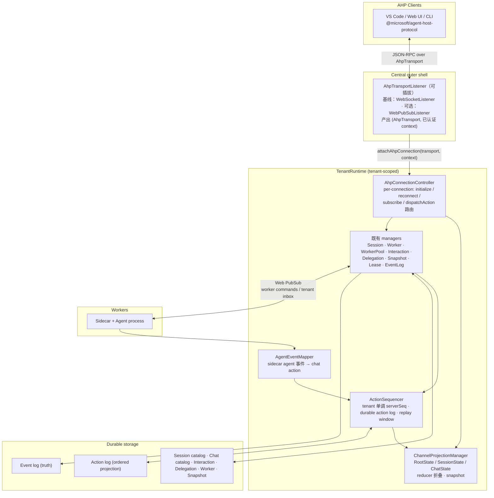

# 成为 AHP Host：架构对齐报告

状态：架构研究与目标态提案
读者：架构师、runtime owner、central/sidecar owner、SDK owner

参考基线：
- 协议侧：`C:\Users\chenyl\agent-host-protocol`，`PROTOCOL_VERSION = 0.7.0`（DRAFT，明确预期 breaking change）。
- 运行时侧：本仓库 [runtime-resource-model-ch.md](runtime-resource-model-ch.md)、[durable-interaction-broker-ch.md](durable-interaction-broker-ch.md)、[durable-agent-delegation-ch.md](durable-agent-delegation-ch.md)、[../sdk/client/public-protocol-spec-ch.md](../sdk/client/public-protocol-spec-ch.md) 与 `src/`。

---

## 1. 结论

**可以做，而且做完之后架构会比现在更干净。** AHP 要解决的问题（N 个 client 共享同一批 agent session 的状态同步）与我们要解决的问题（session 是 durable identity、worker 是可替换算力）是正交的，且 AHP 官方 doctrine 明确把 agent loop、model provider、tool registry、hosting、恢复语义都排除在协议之外——这些恰好全部是我们的地盘。AHP 不会要求我们放弃 Worker/WorkerPool/lease/snapshot/pause/Delegation 中的任何一个。

### 指导原则

**一、资源模型必须完整符合 AHP，运行时行为用 capability 收窄。** 凡是 AHP 用 capability 表达的可选能力（多 chat、fork/sideChat、多工作目录），我们的模型都必须无条件支持，由 adapter 的能力声明和 controller 的准入策略决定实际开放到什么程度。任何把"当前只需要这么多"硬编码进资源身份、存储布局或事件信封的做法都是把净效果当成了原语，将来放开时会变成模型改动而不是配置改动。

**二、不迁就现状。** 现有实现里建错的部分一并改掉，不为了减少 diff 而保留。判断标准只有一个：**改完之后的模型是不是干净的**。本仓处于预发布阶段，没有外部用户数据需要兼容，因此不写 fallback、不写兼容 shim、不保留双行为路径；一次性 dev 数据直接删。如果某个决定写出来丑，先回头问“是不是在迁就一个本身就建错的模型”，而不是把丑写进映射层。需要一并修掉的现有缺陷见第 7 节。

### 必须改的内部设计

这**不是加一层适配器就能自然实现**的事情。有四处：

1. **Session / Chat 职责切分**：`ChatRecord` 成为一等 durable 资源，拥有独立 `chatId` 与自己的 turn 序列；Session 保留 Worker 绑定、lease、workspace、snapshot、pause/resume。事件信封新增 `chatId`。
2. **客户端协议形态**：从"Web PubSub group 广播 + 自造 `ackId` 关联 + 扁平事件流"换成"单条双向 JSON-RPC 流 + channel 订阅 + 有序 action + snapshot/replay"。`ackId`、`client-private-inbox`、`SdkRuntimeEvent` 这套关联机制会被 JSON-RPC request id 与 `serverSeq` 完整取代。
3. **Turn 内容模型**：`agent.output` 这个大杂烩 payload 无法被 reduce，必须拆成 typed response part（create-then-append，带 `partId`）与 tool call 状态机（七态，带 `toolCallId`）。
4. **Interaction 的对外表达**：durable Interaction broker 的内部机制（CAS、first-response-wins、lease fencing）全部保留，但对外不再是独立的 `interaction.*` 事件族，而是收编进 AHP 的 tool call confirmation / client tool execution / elicitation 三条既有通道，并由 `session/inputNeeded` 做会话级聚合。

不需要改：event log 作为 durable truth 的地位、Worker/WorkerPool/HostPoolInstance/lease/snapshot 全套调度与恢复、tenant/authorization/audit 边界。

有一处 AHP 目前没有表达能力：**pause/resume**。这是我们的核心差异化能力，AHP 词汇表里没有对应命令。结论是把它保留为 host 内部生命周期，在 AHP 视图里只体现为 `status`/`activity` 变化，并向上游提 proposal。

---

## 2. AHP 事实基线

### 2.1 协议骨架

| 维度 | 事实 |
| --- | --- |
| 消息框架 | JSON-RPC 2.0 |
| 传输 | 不规定，要求可靠、有序、双向、完整消息边界；WebSocket 是事实标准（VS Code 参考实现用它） |
| 路由键 | 每一条 command params 和每一条 notification params 都带顶层 `channel: URI`；连接级命令固定为字面量 `'ahp-root://'` |
| 状态模型 | 每个 state channel 持有一棵不可变状态树，只能由 action 经 pure reducer 变更 |
| 排序 | server 为每个 action 分配全局单调 `serverSeq`，装进 `ActionEnvelope` |
| 一致性 | write-ahead reconciliation：client 乐观应用自己的 action，server 回声后对账；server-wins |
| 断线恢复 | `reconnect(clientId, lastSeenServerSeq, subscriptions[])` → replay 缺失的 action envelope，或超出 buffer 时下发全新 snapshot；protocol notification 不重放 |
| 版本 | SemVer，`initialize` 一次性协商；capability-first，然后才 promote 成 baseline |

### 2.2 Channel 层级

```text
ahp-root://                 RootState { agents, activeSessions, terminals, config }
  └─ session catalog        不在 state 里：listSessions() + root/sessionAdded|Removed|SummaryChanged
ahp-session:/<uuid>         SessionState { provider, title, status, activity, lifecycle,
                                           chats[], defaultChat, activeClients[], serverTools[],
                                           customizations[], changesets[], inputNeeded[], config }
  └─ ahp-chat:/<cid>        ChatState { turns[], activeTurn, responseParts, steering/queued,
                                        draft, status, activity, origin, workingDirectories }
ahp-terminal:/<id>          ahp-changeset:/<id>   ahp-otlp:   ahp-resource-watch:/<id>
```

关键点：**session 是协调作用域，chat 才是会话内容的载体**。一个 session 默认带一个 chat；多 chat 由 `AgentCapabilities.multipleChats` 门控，支持 `fork` 与 `sideChat`。chat 之间是平等 peer，`ChatOrigin` 只是渲染提示，不是层级结构。

### 2.3 Turn 与 tool call

- `Turn { id, message, responseParts[], usage, state: complete|cancelled|error }`，`ActiveTurn` 是进行中的同构对象。
- `responseParts` 是**单一有序数组**，混合 `markdown` / `reasoning` / `toolCall` / `contentRef` / `inputRequest` / `systemNotification`。
- 文本用 create-then-append：先 `chat/responsePart` 建一个带 `id` 的 part，再用 `chat/delta`（或 `chat/reasoning`）按 `partId` 追加。
- Tool call 是 `status` 上的判别联合，七个状态：`streaming` → `pending-confirmation` → `running` → (`auth-required`) → `pending-result-confirmation` → `completed` / `cancelled`。
- `ToolCallContributor` 区分 `client` 贡献（由某个 active client 执行并回填结果）与 `mcp` 贡献。
- Elicitation 是 `InputRequestResponsePart`：live 交互与 durable 记录是同一个对象，多 client 共享 answer draft。
- `SessionState.inputNeeded` 是会话级聚合，四种 kind：`chatInput`、`toolConfirmation`、`toolClientExecution`、`toolAuthentication`；每条自带 `chat` URI 与全部回答所需标识，client **无需订阅该 chat** 即可作答。

### 2.4 命令面

- 连接级：`initialize`、`ping`、`reconnect`、`subscribe`、`unsubscribe`、`dispatchAction`、`listSessions`、`authenticate`、`resolveSessionConfig`、`sessionConfigCompletions`。
- session/chat 级：`createSession`、`disposeSession`、`createChat`、`disposeChat`、`fetchTurns`、`completions`。
- 文件系统族（9 个 `resource*` + `createResourceWatch`）：**双向对称**，server 也能向 client 发起。
- terminal / changeset：`createTerminal`、`disposeTerminal`、`invokeChangesetOperation`。
- 错误码：`SessionNotFound -32001`、`ProviderNotFound -32002`、`SessionAlreadyExists -32003`、`TurnInProgress -32004`、`UnsupportedProtocolVersion -32005`、`AuthRequired -32007`、`PermissionDenied -32009`、`Conflict -32011`。

### 2.5 AHP 明确不做的事

agent loop、model provider/路由、tool registry 与 tool schema、agent 之间的协调语义、UI 框架、"每个 workspace 都有本地文件系统或 git"的假设、以及 ACP 的替代品。

**这一段是整份报告最重要的依据**：AHP 是 client-facing presentation & synchronization layer，它上面是 client，下面是 host 自己的运行时。我们的 durable session runtime 正是"下面那一层"。

---

## 3. 我们的事实基线

| 维度 | 现状 |
| --- | --- |
| client 传输 | `POST /client/negotiate` 拿 Web PubSub access URL；client join 四类 group：`tenant-inbox`（发命令）、`client-inbox`（tenant 投影）、`client-private-inbox`（ack/查询响应）、`session-events`（会话内容） |
| 请求关联 | SDK 生成 `ackId`，central 把 ack 事件投到 `client-private-inbox` |
| 事件模型 | 单一扁平 `RuntimeEvent` union（约 50 个 type），`sequence` 是 **per-session** 的 |
| 会话模型 | `SessionRecord`：10 态 `SessionStatus`（created/queued/starting/running/pausing/paused/resuming/completed/cancelled/failed）+ `currentWorkerId` + `sessionLeaseId` + `eventCursor` + `nextTurnSeq` + `workspaceRef` + `latestSnapshotRef` |
| 会话内容 | 没有 chat 概念；`turnSeq` 单调递增；agent 输出全部塞进 `agent.output` 的 `AgentOutputPayload` |
| 交互 | `InteractionRecord`：public `interactionId` / 内部 `adapterRequestId` / `views[]` / revision CAS / owner lease fencing / delivery checkpoint；kind 为 `approval` 或 `tool_call` |
| 委派 | `Delegate`（注册的 subagent tool）→ `Delegation`（per Parent+Delegate 唯一，持有一个可复用 Child Session）→ FIFO `DelegationCall` |
| 算力 | `WorkerPool` / `HostPoolController` / `HostPoolInstance` / `Worker`（心跳租约）+ label selector 匹配 + Docker/Foundry host-pool adapter |
| 恢复 | workspace snapshot + agent state + event log；`reuse:false` 池支持 session-pinned host |
| 治理 | tenant 是一等边界，`TenantRuntime` 是 composition root；`RequestContext.principal` 贯穿 ingress |

---

## 4. 结构性判断

三句话：

1. **我们的 central session service 就是 AHP 意义上的 host。** 它已经具备 AHP 假设的一切前提：host 权威状态、多 client、断线重连、有序事实、session 目录。
2. **我们缺的不是能力，是表达形态。** durable event log 已经是"有序、可 replay、host 权威"的事实流，只是它的形状是"运维事件"而不是"可 reduce 的 UI 状态变更"。
3. **AHP 的 session/chat 二层结构对我们不是负担，反而正好填上我们缺的一层。** 我们现在把"协调作用域"和"会话内容"压在同一个 `SessionRecord` 上，这也是为什么 Delegation 的 Parent/Child 关系在 SDK 里只能靠 `parentSessionId` 这样一个扁平字段表达。

---

## 5. 概念映射表

| AHP 概念 | 我们的对应物 | 契合度 | 说明 |
| --- | --- | --- | --- |
| host（一个 AHP endpoint） | 一个 `TenantRuntime` | 天然 | 一个 AHP 连接 = 一个 tenant 视图；tenant 在 transport 握手确定，不进 AHP wire |
| `ahp-root://` / `RootState` | tenant 级 registry 投影 | 天然 | `agents[]` 来自 `AgentSpecRegistry`，`activeSessions` 来自 session catalog |
| `AgentInfo.provider` | `AgentSpec.agentSpecId` | 天然 | AgentSpec 的 launch/selector/pausePolicy 等调度字段不上 wire |
| `AgentInfo.models[]` | 尚未建模 | 缺口 | 先返回空数组；模型选择进入产品范围后从 AgentSpec 的 provider config 派生 |
| `listSessions` + `root/session*` | `session.list.requested` + `client-inbox` 的 `session.catalog.updated` / `session.status.updated` | 天然 | 语义几乎一一对应，我们已经有 tenant 投影通道这个概念 |
| `ahp-session:/<uuid>` | `SessionRecord` | 需改 id 来源 | 见决定 A |
| `SessionState.lifecycle` | 无直接对应 | 映射 | `creating` → 首次进入 running 之前；之后恒为 `ready` |
| `SessionState.status`（位集） | `SessionStatus`（10 态） | 映射 | 见决定 D |
| `SessionState.activity` | `lifecycleReason` + 状态名 | 天然 | AHP 明确把它定义为人类可读描述，正好装我们的 `queued`/`paused`/`resuming` |
| `SessionState.serverTools` | `ResolvedAgentSpec.runtimeTools` | 天然 | Delegate 派生的 subagent tool 就是 server tool |
| `SessionState.activeClients[].tools` | 无 | 新增 | 我们的 `interaction kind='tool_call'` 隐含了"client 提供工具"，AHP 让它显式化 |
| `ahp-chat:/<cid>` / `ChatState` | 无 | 新增一等资源 | `ChatRecord` 独立 `chatId`；见决定 B |
| `SessionState.chats[]` / `defaultChat` | 无 | 新增 | Session 拥有 chat 目录；见决定 B |
| `Turn` / `ActiveTurn` | `turnSeq` + event 序列 | 需改内容模型 + 改作用域 | 序列从 session-scoped 迁到 chat-scoped（决定 B），内容 typed 化（决定 C） |
| `chat/turnStarted` | `input.accepted` | 天然 | |
| `chat/delta` + `chat/responsePart` | `agent.output.delta` / `.message` | 需改 | 缺 `partId`，无法可靠 reduce |
| `ToolCallState` 七态 | `agent.output.toolStarted/.toolCompleted` + 独立的 `interaction` | 需合并 | 见决定 C |
| `chat/turnComplete` / `chat/error` | `turn.completed` / `turn.failed` | 天然 | |
| `chat/usage` / `UsageInfo` | 无 | 新增 | 低成本 |
| `InputRequestResponsePart`（elicitation） | 无独立表达 | 新增 | |
| `SessionInputRequest.toolConfirmation` | `Interaction kind='approval'` | 需绑定 toolCallId | 见决定 C |
| `SessionInputRequest.toolClientExecution` | `Interaction kind='tool_call'` | 天然 | |
| `ChatOrigin.kind='tool'` + `ToolResultSubagentContent` | `Delegation` / Child Session | 高度契合 | 见决定 E |
| `ChatInteractivity.ReadOnly` | 无 | 新增 | 正是为 agent-team / worker chat 设计 |
| `disposeSession` | 无（只有 cancel） | 新增 | |
| pause / resume | `session.pause.requested` / `session.resume.requested` | **AHP 无对应** | 见决定 F |
| Worker / WorkerPool / HostPoolInstance / lease | — | AHP 不涉及 | 完全留在 host 内部 |
| WorkspaceSnapshot / restore / recovery mode | — | AHP 不涉及 | 完全留在 host 内部 |
| tenant / audit | — | AHP 不涉及 | 完全留在 host 内部 |
| `authenticate` + `protectedResources` | 无 | 新增 | RFC 9728/6750 语义 |
| `resource*` 文件系统族 | 无 | 可后置 | 我们的 workspace 在 Worker 里，可作为差异化能力 |
| terminal / changeset / annotations / otlp / MCP customizations | 无 | 不实现 | AHP 增量可采纳，不声明 capability 即可 |

---

## 6. 六个必须做出的结构性决定

每条给出唯一结论，不留实现分支。

### 决定 A：session identity 改为 client 生成

**现状**：`sessionId` 由 central 生成，client 靠 `ackId` 把创建请求和结果关联起来。
**AHP 要求**：client 挑 URI（`ahp-session:/<uuid>`），`createSession` 以 URI 为幂等键，重复则返回 `SessionAlreadyExists -32003`。

**决定**：`SessionRecord.sessionId` 改为 client 提供的 UUID，central 只负责 admission 与唯一性校验。

**理由**：这不是让步，是净简化。它让 create 天然幂等（重试不会造出第二个 session），让 client 在 RPC 返回前就能 `subscribe`，并且直接消灭 `ackId` + `client-private-inbox` 这一整套自造关联机制——JSON-RPC 的 request id 已经覆盖它。

**影响面**：`SessionManager.startSession`、`SessionStartManager`、SDK、`session.create.requested` payload。改动小，风险低。

### 决定 B：Chat 是一等 durable 资源；「一个 session 一个 chat」是 capability 约束，不是模型恒等式

AHP 自己就把「一个 session 能不能有多个 chat」定义成 `AgentCapabilities.multipleChats` 这个 capability。因此**完美符合 AHP 的唯一方式就是把它建成 capability**：模型侧无条件支持 Session 1..N Chat，运行侧由 agent 声明的能力决定实际允许几个。把 1:1 硬编码进身份或存储布局，就是把净效果当成了原语。

**决定**：

1. **`ChatRecord` 是一等 durable 资源**，拥有 central 分配的独立 `chatId`（**不从 `sessionId` 派生**）。字段：`chatId`、`sessionId`、`title`、`status`、`activity`、`origin`、`interactivity`、`nextTurnSeq`、`workingDirectories?`、`modifiedAt`。
2. **turn 序列归 Chat**。`SessionRecord.nextTurnSeq` 迁移到 `ChatRecord.nextTurnSeq`；`turnId` 在 chat 内唯一，不再是 session 全局。
3. **事件信封新增 `chatId`**。会话内容事件（input、agent output、tool call、turn 终态、interaction）带 `chatId`；算力与生命周期事件（assign、pause、lease.lost、worker.*）只带 `sessionId`。
4. **Session 拥有 chat 目录**：`chatIds[]` + `defaultChatId`。Session 创建时由 central 自动建立 default chat 并 append `session/chatAdded`。
5. **职责切分固定为「Session 拥有算力与工作现场，Chat 拥有对话」**：Worker 绑定、`sessionLeaseId`、`workspaceRef`、snapshot、pause/resume 全部留在 Session；turns、responseParts、tool call、pending message、draft 全部在 Chat。Session 的 idle 判定改为「所有 chat 都没有 active turn」。
6. **并发 chat 数由能力声明约束**，不由模型约束。AgentSpec 通过其 agent adapter 声明是否能多路复用对话线程；未声明时 central admission 拒绝第二个 `createChat`，并对应地不在 `AgentInfo.capabilities` 里放 `multipleChats`。

**当前落地程度**：所有 agent adapter 都不声明多 chat 能力，因此每个 session 实际恒定一个 chat。这是运行时事实，不是模型限制。

**解开多 chat 时允许改什么、不允许改什么**（这是本决定的验收判据）：

| 允许改 | 不允许改 |
| --- | --- |
| agent adapter 声明 `multipleChats`（含 `fork` / `sideChat`） | `ChatRecord` / `SessionRecord` / 事件信封 / `InteractionRecord` / `DelegationCall` 的 schema |
| central admission 放行 `createChat` | 存储布局与 id 分配方式 |
| workspace adapter 提供 per-chat 视图（例如每 chat 一个 git worktree） | AHP wire contract 与 channel URI 形态 |
| sidecar agent adapter 多路复用对话线程 | Session 对 Worker / lease / snapshot 的所有权 |

换句话说：开启多 chat 必须是 **adapter 能力声明 + controller 准入策略** 的改动，落不到资源模型上。如果将来发现必须改 schema 才能支持多 chat，说明这一版建模是错的。

**真实前置条件**：多 chat 的障碍不在协议，在两处运行时事实——同一个 Worker 上的 agent process 能否承载两条独立对话线程，以及两条 chat 同时改同一份 workspace 的隔离方式。AHP 给出的隔离手段是 per-chat `workingDirectories`（官方例子是每 chat 一个 git worktree），我们的 `ChatRecord.workingDirectories` 字段为此预留。

**为什么 Delegation Child 不是 chat 而是 session**：AHP session 只有**一个** `provider`、一套 workspace 归属、一个 `lifecycle`。我们的 Child 有自己的 AgentSpec、自己的 Worker、自己的 workspace、自己的 pause/resume 与 snapshot——它需要的正是 Session 拥有的那一半职责。塞进 Parent 的同一个 AHP session 会撕裂 AHP 自身的字段语义。见决定 E。

### 决定 C：Turn 内容模型 typed 化，Interaction 收编进 tool call 状态机

**现状问题**（这是真实缺陷，不只是不匹配）：
- `agent.output.delta` 没有 `partId`。当文本、reasoning、tool call 交错时，客户端只能猜测该往哪里追加。
- `agent.output.toolCompleted.toolName` 在 `copilot-process-adapter.ts` 里被误填成 `toolCallId`。这类错误之所以没被发现，正是因为 payload 是无结构大杂烩。
- `approval` interaction 与触发它的 tool call 之间**没有任何关联标识**。UI 无法把"请批准 shell 命令"渲染在对应的 tool call 卡片上。

**决定**：
1. sidecar → central 的 agent 事件契约（`SidecarAgentProcessEvent`）重构为 typed 事件族，携带 `partId` / `toolCallId` / `turnId`：
   `response.part.created`、`response.delta`、`reasoning.delta`、`tool.call.started`、`tool.call.delta`、`tool.call.ready`、`tool.call.completed`、`tool.call.failed`、`usage.reported`、`input.requested`。
2. central 侧新增 `AgentEventMapper`，把这些事件确定性地映射成 AHP chat action。
3. **approval interaction 必须绑定 `toolCallId`**。sidecar adapter 负责在 agent 事件流里建立 permission request → tool call 的关联。关联不上视为 adapter 缺陷，按根因修复，不引入"无关联时降级成 elicitation"这样的分支。
4. `Interaction kind='approval'` 对外表达为 tool call 的 `pending-confirmation` 状态 + `session/inputNeededSet{kind:'toolConfirmation'}`，回答通道是 `chat/toolCallConfirmed`。
5. `Interaction kind='tool_call'` 对外表达为 `ToolCallRunningState` + `contributor:{kind:'client', clientId}` + `session/inputNeededSet{kind:'toolClientExecution'}`，回答通道是 `chat/toolCallComplete`。
6. agent 主动向用户提问（非 tool 相关）走 `chat/inputRequested` / `InputRequestResponsePart`。

**保留不变**：`InteractionRecord` 的 revision CAS、first-response-wins、`already_resolved` 幂等语义、owner lease fencing、delivery checkpoint、`interaction.interrupted` 的终结逻辑。它们从"公共事件族"降级为"内部仲裁机制"，对外只以 AHP action 呈现。

### 决定 D：拆开被压平的三个正交维度，AHP 映射自然成立

**现状问题**：`SessionStatus` 把三个正交维度压成了一个 10 值枚举：

- 会话本身是否还在：`created` / `completed` / `cancelled` / `failed`
- 算力放置到哪一步：`queued` / `starting` / `pausing` / `paused` / `resuming`
- 当前对话在干什么：`running` 同时表示"有 worker"和"可以接消息"，却不区分"正在跑 turn"与"空闲等输入"

压平的后果是状态机膨胀（`pausing`/`resuming` 这类瞬态本质上是放置过渡，却占据了会话状态位），且 chat 层引入后无法表达"一个 session 上多个 chat 各自的活动"。

**决定**：拆成三个正交字段，删除原枚举。

| 字段 | 归属 | 取值 | 含义 |
| --- | --- | --- | --- |
| `lifecycle` | Session | `active` / `completed` / `cancelled` / `failed` | 会话本身是否还在，后三者终态 |
| `placement` | Session | `unplaced` / `queued` / `starting` / `placed` / `releasing` | 算力归属，host 内部概念 |
| `activity` | **Chat** | `idle` / `running` / `awaiting-input` / `failed` | 这条对话在干什么 |

“paused”不再是一个状态值，而是 `lifecycle: active` + `placement: unplaced` 这个组合的名字。“resuming”就是 `placement: starting`。两个瞬态枚举值消失。

**AHP 映射随之变成恒等式**：

| AHP 字段 | 来源 |
| --- | --- |
| `SessionState.lifecycle` | `creating`（首次 `placed` 之前）/ `creationFailed`（首次放置失败）/ `ready`（其余） |
| `SessionState.status` 位集 | 从 **chat activity 聚合**：任一 chat `awaiting-input` → `InputNeeded`；任一 `failed` → `Error`；有 `running` → `InProgress`；否则 `Idle` |
| `ChatState.status` 位集 | 该 chat 自己的 `activity` |
| `SessionState.activity`（字符串） | 从 `placement` 生成：`waiting for capacity` / `starting worker` / `paused` / `releasing worker` |
| `_meta.runtime` | `placement`、`currentWorkerId`、`sessionLeaseId`、`latestSnapshotRef` |

**为什么这才是对的**：AHP 本来就规定 `SessionState.status` 是从 chats 聚合出来的。旧枚举把放置和活动绑在一起，根本无法参与这个聚合——之前需要的那张逐行枚举映射表就是压平的症状，而不是 AHP 难适配。拆开之后不需要映射表。

`_meta` 是 AHP 明确保留的 escape hatch，此处是正当用法：baseline 体验不依赖它，我们自己的运维 UI 依赖它。

### 决定 E：Delegation Child 是独立 AHP session，用 tool-origin + subagent content 表达因果

**决定**：
- Child Session → 独立的 `ahp-session:/<childSessionId>`，出现在 `listSessions` 里（与现有 SDK 语义一致：Child 是普通 durable Session）。
- Child 的 default chat 携带 `origin = { kind: 'tool', chat: 'ahp-chat:/<parentSessionId>', toolCallId }`。
- Parent 那次 delegate tool call 的结果里带 `ToolResultSubagentContent { resource: 'ahp-chat:/<childSessionId>', title, agentName, description }`。
- Child 的 chat 设 `interactivity: 'read-only'`（用户可观察但不直接发消息，输入由 Parent 的 delegate 调用驱动）。

**放弃**：wire 层面的 Parent interaction projection。

**理由与代价**：AHP 里每个 chat 都是平等可寻址的，任何有权限的 client 都可以直接订阅 Child chat 并对它的 tool call `dispatchAction`。Parent 的 UI 通过 `ToolResultSubagentContent` 就能拿到 Child chat URI 并内联渲染其待批准项。这比我们现在"把同一个 `interactionId` 投影成 Parent 的第二个 view"更简单，也避免了跨 session 的 `inputNeeded` 条目（AHP 的 `inputNeeded` 定义为"聚合本 session 内所有 chat"）。

代价是：Parent 侧客户端必须额外 `subscribe` 一次 Child chat 才能看到待批准项，不能只靠 Parent 的 session state。这是可接受的——AHP 的懒加载订阅模型本来就是这么设计的，而且 `root/sessionSummaryChanged` 会让 Child session 在会话列表里亮起 `InputNeeded`。

`InteractionRecord.views[]` 因此简化为单一 owner + 由 Delegation 关系推导的授权 principal 集合。

### 决定 F：客户端接入是 transport-pluggable 的，基线 transport 是 central 直接终结的 WebSocket

**基线不可让步的理由**：采用 AHP 的最大收益是"任何 AHP 客户端不改一行代码就能连上我们"。VS Code 内置的 Agent Sessions 客户端、ahpx，以及官方 Rust / Swift / Go / Kotlin 客户端都只自带 WebSocket transport。如果基线传输是 Web PubSub，这些客户端一个都连不上——那等于要了 AHP 的形状，丢了 AHP 的生态。基线还顺带保证自托管部署不依赖 Azure。

**决定**：

1. **基线 transport**：central 直接终结 WebSocket，`GET /ahp?tenantId=...`，一条连接一个 AHP 会话。tenant 与 principal 在握手阶段解析（AHP 明确规定 endpoint 门禁属于 transport 层，在 `initialize` 之前完成）。
2. **host 侧引入 transport 抽象，形状镜像 AHP 客户端**。AHP 协议是对称的（server 也会发起 `resource*` 与 `createResourceWatch` request），所以**每连接的接口与客户端的 `AhpTransport` 完全同构，直接复用**：

   ```ts
   // 复用 @microsoft/agent-host-protocol/client 的 AhpTransport
   //   send(message: JsonRpcMessage | string): Promise<void> | void
   //   recv(): Promise<TransportFrame | null>     // null = 干净关闭，异常关闭抛错
   //   close(): Promise<void> | void

   interface AhpAcceptedConnection {
     transport: AhpTransport;
     context: RequestContext;   // 握手期已认证的 tenant + principal
   }

   interface AhpTransportListener {
     start(accept: (connection: AhpAcceptedConnection) => void): Promise<void>;
     stop(): Promise<void>;
   }
   ```

3. **listener 的唯一职责是产出 `(transport, 已认证 context)`**。它之上的一切——JSON-RPC 分发、channel 订阅集、`serverSeq` 分配、action log、reducer 投影、授权、审计——与 transport 无关。
4. **`WebSocketListener` 是基线实现**；`WebPubSubListener` 是可选实现，登记方式相同。

**为什么 Web PubSub 能干净地落进这个接口**（说明它是可插拔，不是硬塞）：

| `AhpTransport` 成员 | WPS listener 的实现 |
| --- | --- |
| accept | `connect` upstream 回调：鉴权、解析 tenant/principal，产出绑定 `connectionId` 的 transport |
| `recv()` | `user event` upstream 回调把入站帧推进该 transport 的队列 |
| `send()` | `WebPubSubServiceClient.sendToConnection(connectionId, ...)` |
| `close()` | `disconnected` 回调，或主动断开 |

客户端侧对应实现一个 `AhpTransport`：解开 WPS 的 `{"type":"message","data":…}` 信封，交出 `{ kind: 'parsed', message }`。AHP 的 `TransportFrame` **已经预留了 `parsed` 变体**，正是为"传输层自带信封"这类场景；客户端的 `HostTransportFactory` 也已经是"每次连接/重连都新开一个 transport"的形状。所以这条路径不需要改动 AHP 协议或客户端内核，只需要一个我们发布的 TypeScript transport 包。代价是其他语言的客户端不会自带它——这正是它作为可选项而非基线的原因。

**不可破坏的判据**：新增一种 transport 不得改动任何 AHP 类型、channel URI 语义、reducer、action log 或 `serverSeq` 分配；只新增一个 host listener 实现，以及（如果该 transport 有自己的信封）一个对应的客户端 transport 实现。若某种 transport 要求改协议层，说明抽象位置放错了。

**两层可靠性不得混淆**：WPS reliable 子协议的 `sequenceId` 是**连接级传输可靠性**（丢包重投、短暂断线续传），对 AHP 完全不可见；AHP 的 `serverSeq` + `reconnect` 是**协议级状态补齐**（跨连接、跨实例、可回落 snapshot）。二者不得互相替代，更不得拿 WPS 的 `sequenceId` 充当 `serverSeq`。

**Web PubSub 在系统里的三个位置**（区分清楚，避免"用不用 WPS"被当成单一开关）：

| 位置 | 用不用 | 理由 |
| --- | --- | --- |
| central ↔ sidecar | **用，并升级到 `json.reliable.webpubsub.azure.v1`** | sidecar 跑在 Docker/Foundry 容器里没有入站端口，必须反向连接，这是 WPS 最强的场景；升级后可以拿掉我们自己在 worker command 路径上写的一部分重传与去重 |
| central 实例之间的 tenant action 扇出 | 用 | central 进程**作为 WPS client connection** 订阅 tenant 组即可，不需要 upstream，也不需要入站端口 |
| client ↔ central | 基线不用；作为可选 listener 保留 | 见上 |

**多实例 central 的已知取舍**：基线 WebSocket 下连接钉在受理它的实例上，该实例通过上一行的 tenant action 流拿到本租户的有序 action 并向自己持有的连接扇出。若将来启用 WPS listener，连接不再钉实例——连接状态（订阅集、`clientId`、`lastSeenServerSeq`、待回的 server→client request）以 `connectionId` 为键放共享存储，任何实例都能处理回调并 `sendToConnection`。这是选择 WPS listener 的主要收益，但不是基线的前提。

**退役**：`client-inbox` / `client-private-inbox` / `session-events` 三个面向 client 的 group 全部删除——它们表达的是 `ackId` 关联与自造投影，已由 JSON-RPC request id 与 AHP channel 订阅取代。`POST /client/negotiate` 一并删除；基线握手就是 WebSocket upgrade 本身。

### 决定 G：placement 由需求驱动，pause/resume 不进入任何客户端契约

使用者不应该知道 session 有"暂停"这回事。他就是聊天。释放算力是我们内部为了省钱做的事，不是需要用户理解的概念。

**决定**：

1. **删除 `session.pause.requested` / `session.resume.requested` 客户端命令**，以及 `session.paused` / `session.resumed` 事件类型。AHP 契约里没有 pause/resume，我们也不提供等价物。
2. **需求驱动放置**。"这个 Session 的任一 chat 有未完成的活儿"就是需求信号：存在 `activeTurn`、`queuedMessages` 非空、或存在未决的 tool confirmation / client tool execution。有需求且未放置 → `placement: queued` → WorkerPool 扩容 → `starting` → `placed`。
3. **消息永远先落状态，再谈算力**。客户端 `chat/turnStarted` 一到就被接受进 chat state；没有 worker 不是拒绝理由。这是"Session 先于 Worker 存在"这条既有不变量在 turn 粒度上的自然延伸。
4. **未放置时到达的输入进 `queuedMessages`**。这不是我们发明的机制：AHP 本来就规定 host 在 chat 空闲或 turn 结束时依次 `chat/pendingMessageRemoved{kind:'queued'}` + `chat/turnStarted` 消费队首。"worker 还没起来"和"上一个 turn 还没结束"对用户是同一种体验，就该用同一个协议机制表达。
5. **释放是 reconcile 的产物，不是命令**。`AgentSpec.idlePauseTimeoutMs` 到期且该 Session 所有 chat 均无需求时释放。运维若需立即回收，走 admin API 触发一次提前的 idle 判定，仍走同一条 reconcile 路径，**不新增第二条释放路径**。
6. **用户可见的只有 `activity` 字符串**：`waiting for capacity` / `starting agent`。不存在名为 `paused` 的状态值（决定 D 已把它变成 `lifecycle: active` + `placement: unplaced` 这个组合的名字）。

**冲突处理**（这是本决定唯一需要想清楚的部分）：

| 竞态 | 机制 |
| --- | --- |
| 释放判定与新输入并发 | 释放只能在**单一串行 reconcile** 中做出，并对观察到的 Session revision 做 CAS。输入推进 revision，使释放作废并重新评估 |
| 输入到达时 worker 正在 pause-at-boundary / 做 snapshot | 输入进 `queuedMessages`，不投递给正在退出的 worker；新 worker 就绪后按 AHP 队列规则消费 |
| 多个 client 在未放置时同时发消息 | 按到达顺序入队，放置完成后 FIFO 消费；AHP 队列消费规则已定义此行为 |
| 旧 worker 释放后仍尝试写入 | `sessionLeaseId` fencing，既有机制不变 |
| 存在未决 interaction 时被判定为 idle | 未决 interaction 本身是需求信号，reconcile 不会判定 idle |
| 放置失败（无 capacity 或启动失败） | Session 停在 `placement: queued`，`activity` 说明原因；已接受的 turn 不丢弃，也不把放置失败伪装成 turn 失败 |

**冷启动**：`activity` 能解释延迟，但解释不了体验。缩短冷启动属于 WorkerPool 的放置策略（预热实例、`reuse:false` 池的 session-pinned host 复用），不是协议或资源模型问题。

**收益**：AHP 没有 pause/resume 词汇这件事不再是缺口——没有东西需要表达。

---

## 7. 必须一并修掉的现有设计缺陷

下面每一条都不是"AHP 不兼容"，而是**现有建模本身就错了**。它们在本次改造中一并修掉，不保留旧路径。

### 7.1 `RuntimeEvent` 把命令、事实、指令、回执、投影混装在同一个 union

一个 `RuntimeEvent` 同时充当五种语义完全不同的东西：

| 语义 | 例子 | 应该是什么 |
| --- | --- | --- |
| 客户端意图 | `session.create.requested`、`input.received`、`interaction.respond.requested` | JSON-RPC request，**不入 event log** |
| durable 事实 | `session.created`、`agent.output`、`turn.completed` | append-only fact，有 sequence |
| Worker 指令 | `session.assign`、pause command、`session.interaction.response` | 带 lease fencing 的 command，不是 fact |
| 回执 | `session.created.ack`、`input.accepted.ack` | JSON-RPC response |
| 租户投影 | `session.catalog.updated`、`session.status.updated` | AHP `root/session*` notification |

把意图（`.requested`）和事实（`.created`）放进同一个类型、同一条流，是典型的 command/event 混淆。它直接导致了 `toClientAckEvent` 那种 `{...event, type, payload}` 复制信封的写法——一个 ack 里带着毫无意义的 `sequence` 和 `sessionLeaseId`。

**修法**：拆成三个不相关的类型族——**Command**（客户端意图，由 AHP JSON-RPC 承担，不持久化）、**Fact**（durable event log，带 `sequence` / `chatId` / `sessionLeaseId`）、**WorkerCommand**（central → sidecar，带 fencing，不入 event log）。回执与投影不再是独立类型，分别变成 JSON-RPC response 与 AHP notification。

### 7.2 `sequence` 字段双语义

SDK 发出的事件都写 `sequence: 0`，central 持久化后才赋真值。同一个字段在上行时是占位符、下行时是排序事实。随 7.1 一起消失：Command 没有 `sequence`。

### 7.3 `AgentOutputPayload.internalEvent` 每条都冗余存一份原始 agent event

当前每一条 delta、每一次 tool 事件都在抽取字段之外另存一份 `internalEvent: { type, data }` 完整原始载荷。event log 体积成倍增长，而且把 adapter 内部形状泄露成了持久化事实。

**修法**：删除。adapter 诊断走日志与 OTLP，不进 durable fact。

### 7.4 `dotnet-process-wrapper` 绑的是 `CopilotProcessAdapter`

`src/sidecar/worker-types.ts` 里 .NET worker type 的 agent-process adapter 填成了 Copilot adapter。这是占位遗留，它让 build profile 这个抽象失去意义。要么提供真的 .NET adapter，要么删掉这个 worker type 与对应的 `docker-dotnet` 配置。

### 7.5 `copilot-process-adapter` 把 `toolCallId` 填进了 `toolName`

`tool.execution_complete` 映射里 `toolName` 取的是 `event.data.toolCallId`。这条 bug 能长期存在，正是因为 payload 是无结构大杂烩（见决定 C）。typed 化之后这类错配会在编译期暴露。

### 7.6 `InteractionView` 把投递进度存进了 canonical record

`requestedProjected` / `respondedProjected` / `interruptedProjected` 三个布尔把"事件有没有发出去"当成了 Interaction 的状态。随决定 E（取消 Parent projection）整组删除，`views[]` 塑回单一 owner + 由 Delegation 关系推导的授权 principal 集。

### 7.7 Interaction 的双 ID 在 tool call 收编后失去理由

`interactionId`（Central public）/ `adapterRequestId`（sidecar）双 ID 是为了避免把 adapter 内部标识泄露给客户端。但决定 C 把 approval 收编成 tool call 的一个状态后，`toolCallId` 已经是客户端、central、adapter 三方共同认可的公开标识。双 ID 应当收到单一 `toolCallId`，除非能举出具体的 adapter 不能接受外部分配 ID 的反例。

### 7.8 `DelegationCall.awaitRequests[]`

一个数组存多条 pending await，用来处理 Parent 重试拉取结果。在 AHP 模型下，Parent 那次 delegate 调用就是一个 `ToolCallRunningState`——它本身就是 await 状态，且由 AHP 的 tool call 状态机保证唯一。数组删除。

### 7.9 `SessionRecord` 的时间/游标字段职责重叠

`eventCursor`、`lastEventUpdatedAt`、`updatedAt` 三个字段语义交叠。Chat 层引入后重新划定：event 游标归 Chat（`ChatRecord` 的已投影位置），Session 只留一个 `updatedAt`。

### 7.10 硬编码的 demo principal

`src/central/http/poc-routes.ts` 里的 `DEMO_CLIENT_CONTEXT` / `DEMO_SIDECAR_CONTEXT` 把 principal 写死成 `demo-user` / `demo-sidecar`。随决定 F 的 transport 握手鉴权一并删除；principal 必须来自真实认证。

### 7.11 `poc-` 命名与仓库残留物

`poc-routes.ts`、`poc-runtime-http.ts`、`copilot-poc.json`、`poc-docker-copilot.json` 等命名已不再反映代码状态；`tmp/` 下四个一次性调试产物被 git 跟踪。一并清理并补 `.gitignore`。

---

## 8. 目标架构



### Ownership boundary

按 [../AGENTS.md](../AGENTS.md) 的规则先判定归属，再放类：

| 新组件 | 归属 | 理由 |
| --- | --- | --- |
| `AhpTransportListener` 实现（WebSocket / Web PubSub） | outer central | 只做连接受理、tenant 解析、principal 认证，产出 `(AhpTransport, RequestContext)` 交给 `tenantRuntime.attachAhpConnection(...)`。**不处理任何业务命令，也不认识 JSON-RPC method** |
| `AhpConnectionController` | tenant runtime | 协议边界（Controller），读写 Session/Chat/Event，天然 tenant-scoped |
| `ActionSequencer` | tenant runtime | 拥有 tenant 单调序列与 durable action log |
| `ChannelProjectionManager` | tenant runtime | 维护 channel state 投影与 snapshot（Manager） |
| `AgentEventMapper` | tenant runtime | 把 sidecar 事实翻译成 AHP action |
| AHP 类型与 reducer | shared contract | 直接依赖 `@microsoft/agent-host-protocol`，不自造一份 |

---

## 9. serverSeq 与 replay 的持久化设计

这是唯一一处需要新增 durable 结构的地方，值得单独说清楚。

**约束**：
- AHP `serverSeq` 是 **host 全局单调**（跨所有 channel），`reconnect` 只带一个 `lastSeenServerSeq`。
- 我们现有的 `RuntimeEvent.sequence` 是 **per-session** 的，无法直接充当 `serverSeq`。
- 一条 durable event 可能映射成多条 action（例如一次 `turn.completed` 同时产生 `chat/turnComplete` 与 `session/chatUpdated`），所以不能给 event 加一个字段就了事。
- central 是多实例的，序列分配必须是存储层原子操作。

**决定**：新增 **per-tenant durable action log**。

- Event log 仍然是 truth，不变。
- Action log 是从 event log **确定性派生**的有序投影：每条记录就是一个 `ActionEnvelope { channel, action, serverSeq, origin }`，`serverSeq` 由 tenant 级原子递增分配，与 event 追加在同一次持久化写入中完成。
- Channel snapshot 由 reducer 从 action log 折叠得到，可周期性物化以加速 `subscribe`。
- `reconnect` 的 replay window 就是 action log 的一段；超出保留窗口时回落到 snapshot（AHP 原生支持这条路径）。
- Action log 丢失可从 event log 重建，重建结果的 `serverSeq` 相同（确定性派生）。它是可重建的投影，不是第二份真相——符合 [runtime-resource-model-ch.md](runtime-resource-model-ch.md) 第 8 节的 source-of-truth 规则。

**存储契约影响**：`RuntimeStorage` 需要新增 tenant 级原子递增序列与 action log 的 append/range-read。`LocalFileStorage` 目前只有原子 JSON 读写，需要扩展。这是本次改造中唯一的存储层新原语。

---

## 10. AHP 表面覆盖矩阵

「实现」列区分三种状态：**必须**＝协议基线，没有它客户端无法工作；**后续**＝模型已就位，接线即可；**不声明**＝不放对应 capability，客户端按协议降级。

| 分组 | 内容 | 实现 | 负责组件 |
| --- | --- | --- | --- |
| 握手 | `initialize`、`ping`、`reconnect`、版本协商、`serverInfo` | 必须 | `AhpConnectionController` |
| 订阅 | `subscribe`、`unsubscribe`、`action` 投递、`delivery.maxLatencyMs` 合并 | 必须 | `AhpConnectionController` + `ChannelProjectionManager` |
| root | `RootState.agents`、`activeSessions`、`root/agentsChanged`、`root/activeSessionsChanged` | 必须 | `AgentSpecRegistry` 投影 |
| session 目录 | `listSessions`（分页）、`root/sessionAdded|Removed|SummaryChanged` | 必须 | `SessionManager` |
| session | `createSession`、`disposeSession`、`SessionState`、`session/ready`、`session/creationFailed`、`session/chatAdded`、`session/activityChanged`、`session/titleChanged` | 必须 | `SessionManager` + `SessionLifecycleManager` |
| chat 基础 | `chat/turnStarted`、`chat/responsePart`、`chat/delta`、`chat/reasoning`、`chat/turnComplete`、`chat/turnCancelled`、`chat/error`、`chat/usage`、`chat/activityChanged` | 必须 | `AgentEventMapper` |
| tool call | `chat/toolCallStart|Delta|Ready|Confirmed|Complete|ResultConfirmed|ContentChanged` 全套七态 | 必须 | `AgentEventMapper` + `InteractionManager` |
| 输入聚合 | `session/inputNeededSet|Removed`、`chat/inputRequested|AnswerChanged|Completed` | 必须 | `InteractionManager` |
| active client | `session/activeClientSet|Removed`、client 贡献 tool | 必须 | `AhpConnectionController` |
| 历史分页 | `fetchTurns`、`chat/turnsLoaded`、`turnsNextCursor`、`view.turns` | 后续 | `EventLogManager`（event log 天然可分页） |
| 认证 | `authenticate`、`AgentInfo.protectedResources`、`auth/required`、`AuthRequired -32007` | 后续 | 新 `AhpAuthController` |
| 会话配置 | `resolveSessionConfig`、`sessionConfigCompletions`、`SessionConfigState` | 后续 | 承载我们的 workspace/labels 输入 |
| 委派 | `ChatOrigin.tool`、`ToolResultSubagentContent`、`ChatInteractivity` | 后续 | `DelegationManager` |
| 补全 | `completions`、`completionTriggerCharacters` | 后续 | |
| 文件系统 | 9 个 `resource*` + `createResourceWatch`（含 server→client 反向） | 后续 | 需 central→worker 的 workspace 访问通道 |
| 多 chat | `createChat`、`fork`、`sideChat`、`multipleChats` capability | 不声明（模型已支持） | agent adapter 声明能力 + admission 放行即可，见决定 B |
| 多工作目录 | `multipleWorkingDirectories` capability | 不声明（字段已预留） | `ChatRecord.workingDirectories` 已在模型内 |
| terminal | `createTerminal`、`ahp-terminal:` | 不声明 | |
| changeset | `ahp-changeset:`、`invokeChangesetOperation` | 不声明 | |
| annotations / MCP customizations / MCP Apps | — | 不声明 | |
| OTLP | `ahp-otlp:` | 不声明 | `InitializeResult.telemetry` 留空 |

AHP 的 capability-first 设计让"不声明"是零成本的：不声明就等于不支持，client 必须降级。注意区分**不声明 capability**（模型支持、只是没打开）与**不实现**（协议表面根本没接线）——多 chat 与多工作目录属于前者。

---

## 11. 无法用 AHP 表达的能力

| 能力 | 处理方式 |
| --- | --- |
| pause / resume | 保留为 host 内部生命周期。AHP 视图只见 `status`/`activity` 变化 + resume 时的冷启动延迟。显式用户控制走我们自己的 runtime admin API（非 AHP 路径）。向 AHP 上游提 proposal（`docs/proposals/` 已有 `multi-chat.md`、`multiroot-sessions.md` 先例） |
| Worker / WorkerPool / HostPoolInstance / 扩缩容 | 完全内部。运维视图走现有 `GET /runtime/status` |
| snapshot / restore / recovery mode | 完全内部。恢复降级原因通过 `session/activityChanged` + `_meta` 暴露 |
| tenant | 一个 AHP endpoint = 一个 tenant 视图，tenant 不上 wire |
| audit | 完全内部，AHP 无对应概念 |
| Delegate 注册与 DelegationCall 记录 | 内部。对外只体现为 server tool + subagent chat |

**判断**：这些恰好全部落在 AHP doctrine 明示的 anti-goal 里（"AHP intentionally does not define... hosting、recovery、agent-to-agent coordination"）。这不是我们在协议外偷跑，而是协议设计上就把这一层留给了 host。这也是"我们的功能可以完整保留"的根本原因。

---

## 12. 实施切片

每片都必须能独立通过"用 AHP 官方 TypeScript client（`@microsoft/agent-host-protocol/client` + `/ws`）连上并跑通"来验收。

| 切片 | 内容 | 验收 |
| --- | --- | --- |
| S0 | 引入 AHP 类型依赖；`AhpTransportListener` 抽象 + 基线 `WebSocketListener`（`GET /ahp`）；`initialize`（版本协商 + `serverInfo`）、`ping`、`subscribe('ahp-root://')`、只读 `RootState.agents`、`listSessions` | 官方 client 连上、拿到 agent 列表与会话列表；同一套 controller 在 `InMemoryTransport.pair()` 下也能跑通（证明协议层与 transport 无关）；不改任何内部模型 |
| S1 | `ActionSequencer` + durable action log + tenant 原子序列（`RuntimeStorage` 扩展）+ `ChannelProjectionManager` + snapshot + `reconnect` replay/snapshot 双路径 | 断开连接、产生变更、重连后从 `lastSeenServerSeq` replay 到一致状态；超窗口回落 snapshot |
| S2 | `createSession`（client URI，决定 A）、`disposeSession`、`SessionState` 全字段、`session/ready|creationFailed`；`ChatRecord` 作为一等资源落地（独立 `chatId`、`nextTurnSeq` 从 Session 迁出、事件信封加 `chatId`、chat 目录与 `session/chatAdded`，决定 B）、`root/session*` 通知 | 官方 client 创建会话、订阅 session channel、从 `chats[]` 拿到 chat URI 并订阅；重复 `createSession` 返回 `-32003` |
| S3 | 事件信封拆分为 Command / Fact / WorkerCommand 三族（第 7.1、7.2 节）；sidecar agent 事件 typed 化（改 `SidecarAgentProcessEvent` 契约，删 `internalEvent`）+ `AgentEventMapper` + chat 基础 action（turn/part/delta/reasoning/complete/error/usage） | 真实 Copilot turn 在官方 client 上正确渲染成有序 response parts；`chat/delta` 全部有 `partId`；没有任何类型既是 command 又是 durable fact |
| S4 | tool call 七态状态机 + Interaction 收编（决定 C）+ 双 ID 收敛为 `toolCallId`（第 7.7 节）+ `session/inputNeeded` 聚合 + `activeClients` | Docker e2e 里的"agent 写文件需批准"场景，用官方 client 通过 `chat/toolCallConfirmed` 批准；`already_resolved` 幂等语义保持 |
| S5 | Delegation → tool-origin chat + `ToolResultSubagentContent` + `ChatInteractivity`（决定 E）；`InteractionView.*Projected` 与 `DelegationCall.awaitRequests` 删除（第 7.6、7.8 节） | Parent 调用 delegate，官方 client 从 subagent content 拿到 Child chat URI 并订阅到 Child 的完整 turn |
| S6 | `authenticate` + `protectedResources` + `AuthRequired`；transport 握手真鉴权，删除 `DEMO_*_CONTEXT`（第 7.10 节）；`resolveSessionConfig`；`fetchTurns` 分页 + `view.turns` | 未授权 principal 被 `-32007` 拒绝并能通过 `authenticate` 恢复；长会话历史可分页加载 |
| S7 | 拆除旧客户端路径：删 `sdk/client`、`/client/negotiate`、面向 client 的三个 Web PubSub group；`samples/` 全部迁到官方 client；清理 `poc-` 命名与 `tmp/` 残留（第 7.11 节） | 仓库内不再存在第二套客户端协议定义；webclient 用官方 client 跑通完整 demo |
| S8 | `resource*` 远程 workspace 访问（central → worker） | 官方 client 通过 `resourceList`/`resourceRead` 浏览运行中 session 的 workspace |

S7 是硬性拆除点：它之前新旧两条客户端路径并存只是为了让切片可验收，它之后不得再有任何旧路径残留。不为旧 SDK 保留兼容层，也不保留双行为开关。

---

## 13. 删除、重建、保留

**删除**（连同它解决的问题一起消失，不留替代物）：
- `ackId` + `client-private-inbox` 请求关联机制 —— JSON-RPC request id 覆盖
- `client-inbox` 的 `session.catalog.updated` / `session.status.updated` —— `root/session*` 覆盖
- `session-events` 面向 client 的 group —— AHP channel 订阅覆盖
- `POST /client/negotiate` —— 基线握手就是 WebSocket upgrade 本身
- `AgentOutputPayload` 大杂烩载荷及其 `internalEvent` 原始转储
- wire 层的 Parent interaction projection 与 `InteractionView.*Projected`
- `SessionStatus` 10 值枚举（拆成 `lifecycle` / `placement` / chat `activity`）
- `DelegationCall.awaitRequests[]`
- **`sdk/client` 这个协议客户端**（见下）

**关于 SDK**：官方 `@microsoft/agent-host-protocol` 已提供 TypeScript / Rust / Kotlin / Go / Swift 五种客户端。我们再维护一份自有协议客户端，就是永久保留一条协议漂移面——[../sdk/client/public-protocol-spec-ch.md](../sdk/client/public-protocol-spec-ch.md) 里"SDK protocol drift 是 release blocker"这条规则的存在本身，就是这条漂移面的证据。成为 AHP host 之后，客户直接用官方客户端；`samples/` 全部迁到官方客户端，这同时就是最好的一致性测试。`public-protocol-spec-ch.md` 相应退役，由本文与 host 私有扩展说明（`_meta` 键、admin API）接替。只有在官方客户端之上确实反复出现同一段样板代码时，才考虑发布一个薄 helper 包，且它不得重新定义任何 wire 类型。

**重建**（概念保留，形状重做）：
- **event log**：仍是 durable truth，但信封拆分为 Command / Fact / WorkerCommand 三族（第 7.1 节），Fact 新增 `chatId`
- **`InteractionRecord`**：CAS、first-response-wins、lease fencing、delivery checkpoint 全部保留；`views[]` 塑回单一 owner，双 ID 收敛为 `toolCallId`
- **`SessionRecord`**：拆出 `ChatRecord`；`nextTurnSeq` 迁出；时间/游标字段收敛
- **`RuntimeChannel`**：从五类收缩为 `tenant-inbox` + `worker-commands` 两类

**保留（不动）**：
- `Delegate` / `Delegation` / `DelegationCall` 的委派语义与 FIFO 串行复用
- `Worker` / `WorkerPool` / `HostPoolController` / `HostPoolInstance` / lease 与心跳
- snapshot / restore / `workspaceRef` 不透明句柄模型
- tenant 边界、`TenantRuntime` composition root、authorization / audit
- central ↔ sidecar 的 Web PubSub 通道与 worker command 投递语义
- `config/` 声明式 AgentSpec / WorkerPool / host-pool-controller

---

## 14. 风险与开放问题

| 风险 | 说明 | 缓解 |
| --- | --- | --- |
| AHP 处于 0.x DRAFT | 官方明确"breaking changes to wire types, actions, and state shapes are expected" | 把所有映射集中在 `AgentEventMapper` + `ChannelProjectionManager` 两个模块；使用 `SUPPORTED_PROTOCOL_VERSIONS` 提供多版本兜底 |
| tenant 级原子序列 | 多实例 central 下 `serverSeq` 必须严格单调 | 作为 `RuntimeStorage` 的一等契约（原子递增），`LocalFileStorage` 需扩展；生产后端需支持条件写 |
| 大 payload | AHP 用 `ContentRef` + `resourceRead` 把大内容移出状态树；我们的 event payload 目前无上限 | S3 引入 payload 尺寸阈值，超阈值转 `ContentRef` |
| approval ↔ toolCallId 关联 | 取决于 Copilot SDK 的 `permission.requested` 是否携带可关联标识 | S4 的第一个待验证项；关联不上按 adapter 缺陷修，不加协议分支 |
| 跨 session 的 `ChatOrigin.tool` | AHP 未明文禁止，但 `createChat` 的 source 约束是同 session | 我们的 tool-origin chat 由 host 创建而非 `createChat`；同时 `MessageChatAttachment` 明确允许跨 session 引用 chat，说明跨 session chat 引用在 AHP 中是被接受的形态。持续跟踪上游 |
| pause/resume 无协议表达 | 用户在标准 AHP client 里看不到显式 pause 控制 | 短期走 admin API；向上游提 proposal |
| `turnId` 类型与作用域 | AHP 用 chat 内唯一的 `string`，我们用 session-scoped `turnSeq: number` | 序列随决定 B 迁到 `ChatRecord.nextTurnSeq`；`turnId = "t" + turnSeq` 在 chat 内唯一。客户端契约不得暴露"turnSeq 是 session 全局单调"这一事实 |
| 会话规模 | AHP 要求 host 保有可 replay 的 action 窗口与可折叠的 channel state | 通过 `fetchTurns` 分页 + snapshot 物化 + action log 保留策略控制 |
| 基线 transport 下的连接亲和性 | central 直接终结 WebSocket 时，连接钉在受理它的实例上；实例重启会断开该实例上的所有客户端 | AHP 自带 `reconnect` + `lastSeenServerSeq`，断线重连到任意实例都能补齐；若这条代价变得不可接受，启用 WPS listener（决定 F）即可去除亲和性，不需要改协议层 |

---

## 15. 一致性检查清单

改造完成时，下列断言必须全部成立：

1. 官方 `@microsoft/agent-host-protocol` client 无需任何我方私有代码即可完成 connect → listSessions → createSession → subscribe → 发消息 → 看流式输出 → 批准 tool call → 断线重连补齐历史。
2. 任何一条 wire 消息都能只凭 `(method, params.channel)` 路由，无需反序列化其余 payload。
3. 每个 client 可见的 durable 事实都能从 channel state 恢复；没有只存在于 ephemeral notification 里的会话真相。
4. `serverSeq` 在 tenant 内严格单调，且 action log 丢失后可从 event log 确定性重建出相同序列。
5. 把某个 agent adapter 的 `multipleChats` 能力打开、并让 admission 放行 `createChat` 之后，第二个 chat 能正常收发消息，且 `ChatRecord` / `SessionRecord` / 事件信封 / `InteractionRecord` / `DelegationCall` 的 schema、存储布局、AHP wire contract **一个字段都没有改动**。
6. outer central 不包含任何 `createSession` / `pause` / `handleEvent` 级别的业务逻辑；它只做 WebSocket 受理、tenant 解析、principal 认证与 `attachAhpConnection`。
7. Worker、WorkerPool、HostPoolInstance、lease、snapshot、tenant、audit 这些名词不出现在任何 AHP wire 字段里（`_meta` 内的运维扩展除外）。
8. `chat/delta` 全部携带 `partId`；`chat/toolCall*` 全部携带 `toolCallId`；没有任何"结构自由"的 agent 输出载荷。
9. 未声明的 capability 对应的 command 全部返回 `MethodNotFound`，且官方 client 能优雅降级。
10. 没有任何类型同时充当客户端命令与 durable fact；事件日志里不存在 `.requested` 这类意图记录。
11. 第 7 节列举的每一条缺陷都已修复，仓库内搜不到 `internalEvent`、`awaitRequests`、`*Projected`、`DEMO_CLIENT_CONTEXT` 这些标识符。
12. 仓库内只存在一套客户端协议定义（来自 `@microsoft/agent-host-protocol`）；`samples/` 不依赖任何自有协议客户端。
13. 协议层与 transport 无关：全套 AHP 行为能在 `InMemoryTransport.pair()` 上跑通，且新增一种 transport 只需新增一个 listener 实现，不触及任何 AHP 类型、channel URI 语义、reducer、action log 或 `serverSeq` 分配。
14. `pnpm build` / `pnpm typecheck` / `pnpm test` 与既有 Docker、Foundry e2e 全绿。
